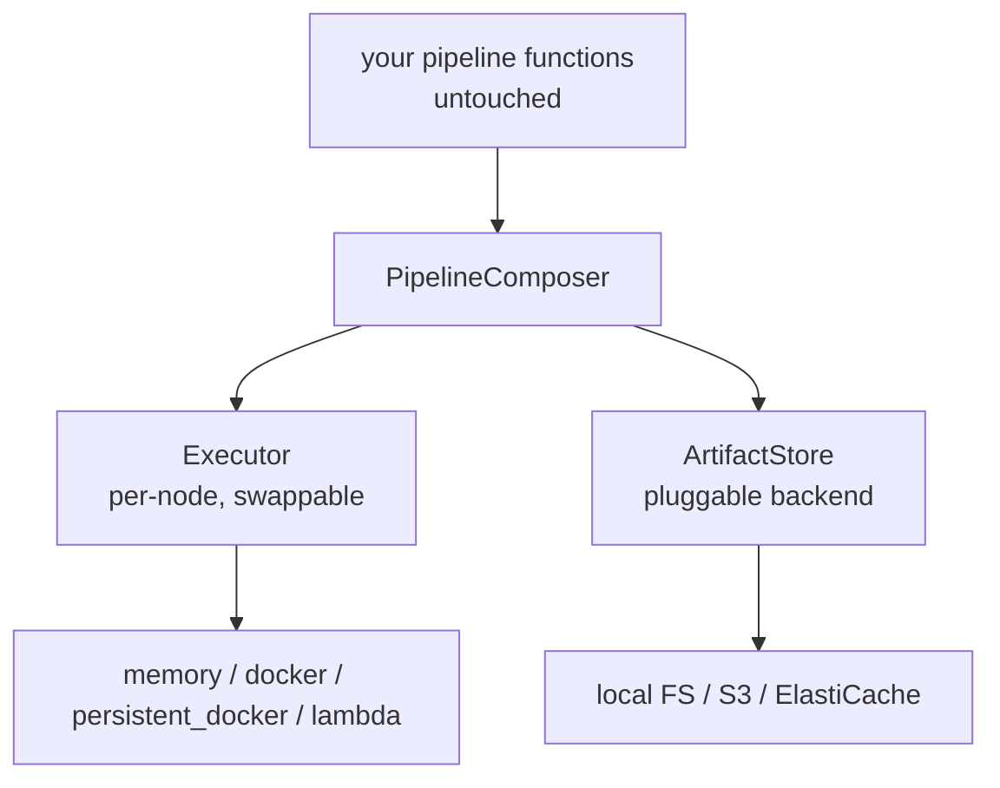
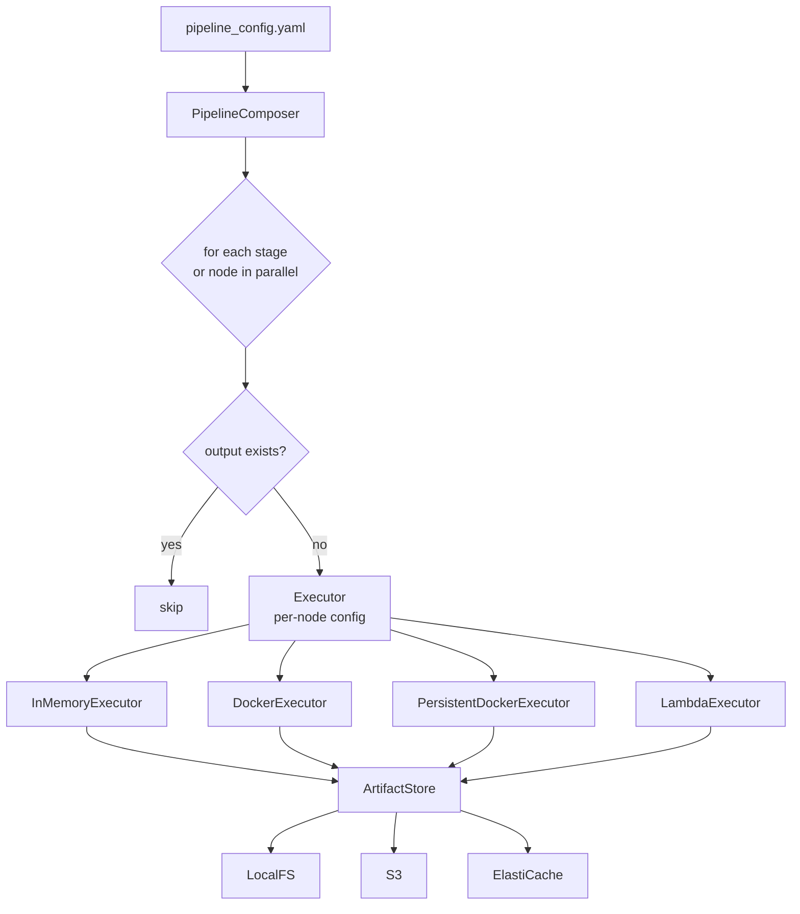

# Pipeline Orchestration: Overview

## The problems

These came directly out of the design discussion.

**1. No way to swap the execution environment**
Every node is hardwired to Docker. Want to test a single function locally without spinning a container? Can't. Want to move a heavy node to Lambda? Rewrite the orchestrator.

**2. Every node gets the entire context, not just what it needs**
The shared `/ctx` folder contains every pkl file from every previous node. Each container loads all of it. When this moves to Lambda or any network-based execution, every extra file is a wasted transfer.

**3. No parallelism**
Nodes that have no dependency on each other still run one after the other. After `split_data` finishes, `training_features`, `training_target`, `test_features`, and `test_target` could all run simultaneously. Today they don't.

**4. No resume on failure**
Pipeline crashes at node 9 of 12. Next run starts from node 1. All previous computation is thrown away.

**5. No standard interface for where data lives**
The `/ctx` folder is hardwired to local disk. Moving to S3, ElastiCache, or any distributed store means touching the orchestrator code directly.

---

## What we built

Three abstractions on top of the existing fn_graph setup. The pipeline functions themselves do not change.

**PipelineComposer** subclasses fn_graph's `Composer`. Inherits all DAG logic. Overrides only how each node executes. Runs a parallel queue instead of a flat loop. Checks if a node's output already exists before running it.

**Executor** is one interface, multiple backends. Which executor a node uses is set in a YAML config file. Change a node from Docker to Lambda: one line. No code changes.

**ArtifactStore** replaces the hardwired `/ctx` folder. Same `get` and `put` interface regardless of whether data lives on disk or in S3. Each node only receives the inputs its function signature asks for, nothing else.

---

## How it fits together

---

## Docs

| | |
|---|---|
| [01 - Extending fn_graph](01_fn_graph_extension.md) | PipelineComposer, how we wrap fn_graph without touching its internals |
| [02 - Executor](02_executor.md) | How nodes run, per-node config, Docker and PersistentDocker executors |
| [03 - Artifact Store](03_artifact_store.md) | Where data lives, memoization, run IDs, pluggable backends |
| [04 - Parallelism](04_parallelism.md) | Queue system, node states, stage-level and node-level parallel execution |
| [05 - Failure and Retry](05_failure_and_retry.md) | Retry logic, failure modes, mid-pipeline resume |
| [06 - Production Readiness](06_prod_readiness.md) | What stands between this design and 80-node CNN production workloads |
