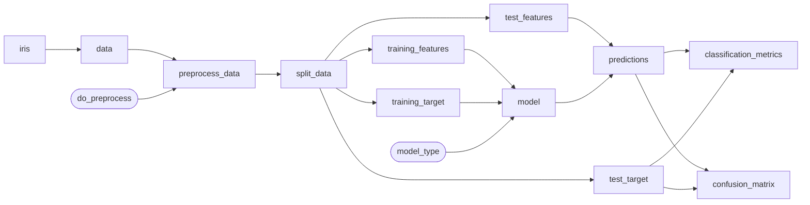
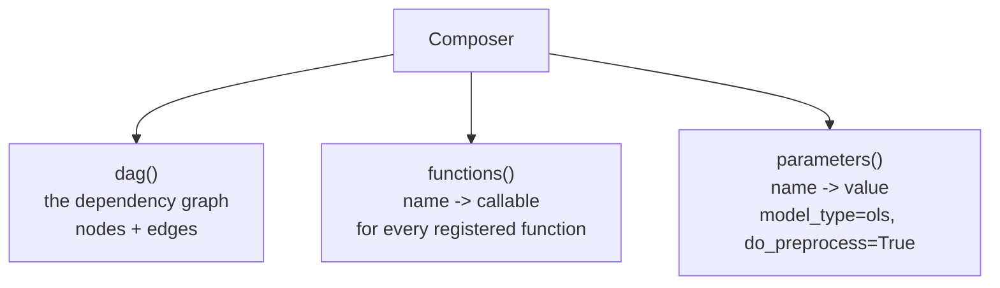
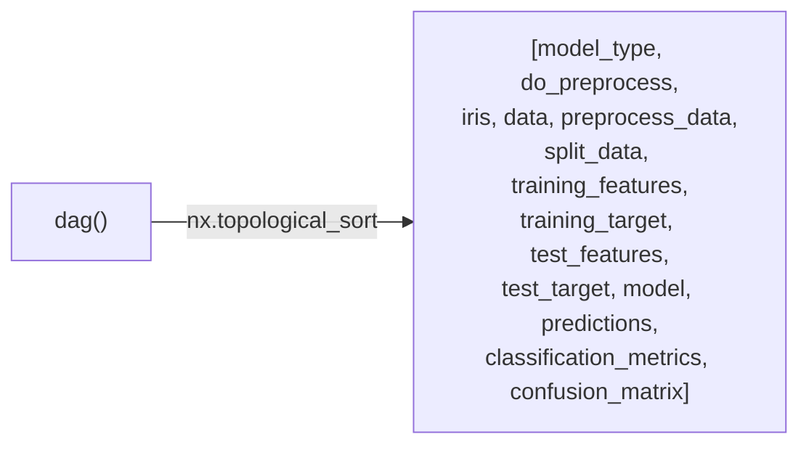
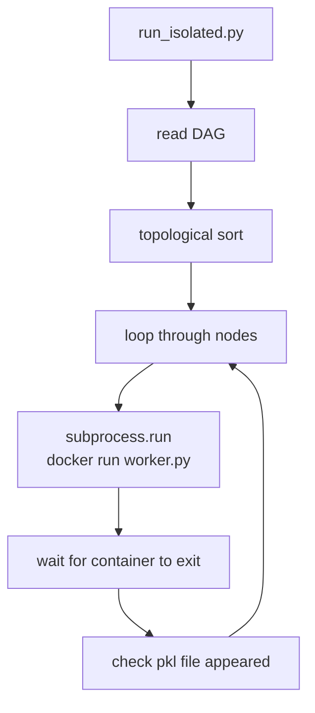
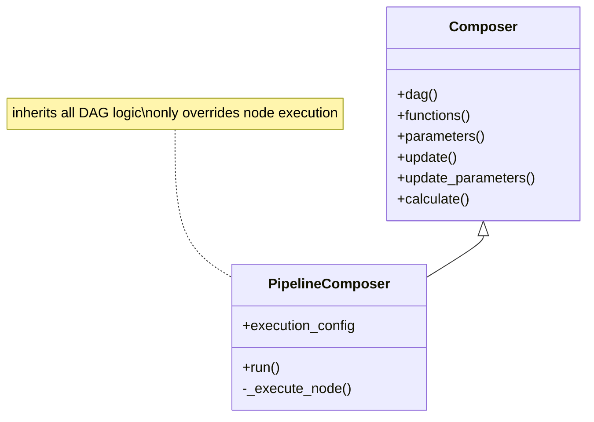
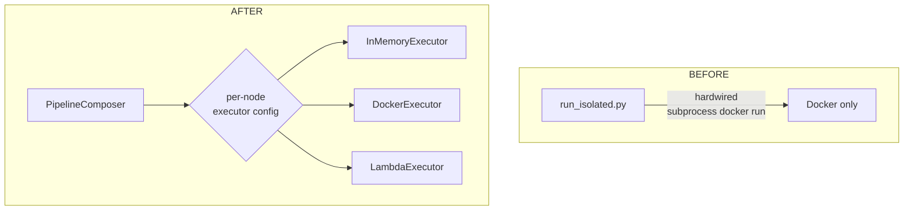
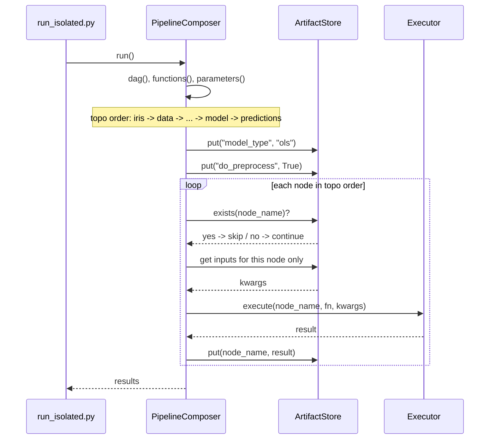
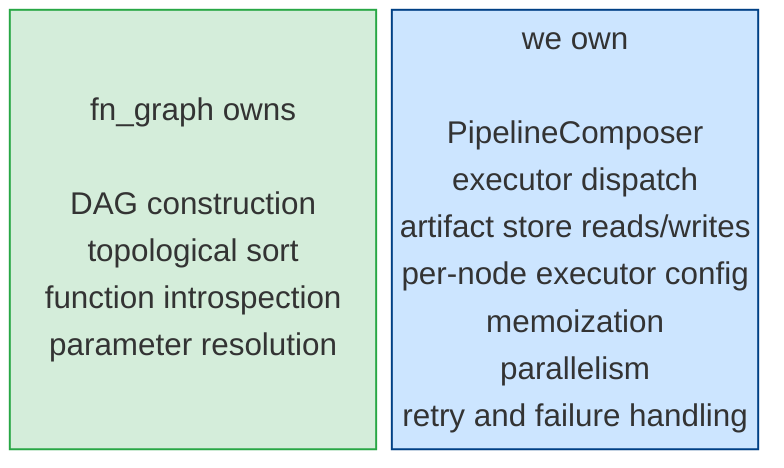
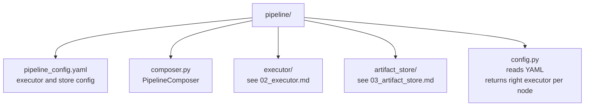

# 01 - Extending fn_graph

## What fn_graph gives us

You write plain Python functions. fn_graph reads their argument names and builds a dependency graph automatically.

```python
def data(iris):          # depends on iris
def model(training_features, training_target, model_type):  # depends on these three
```



No explicit wiring. Argument names are the wiring.

---

## Three things we use from fn_graph



These three methods are the only surface we touch. Everything inside fn_graph stays untouched.

---

## Topological sort

`dag()` gives us the graph. We run topological sort on it to get a flat execution order where every node appears after all its dependencies.



This guarantees that when a node runs, all its inputs already exist.

---

## The problem with the current setup

`run_isolated.py` does everything itself. One script, one hardwired path.



Want to test without Docker? Can't. Want Lambda? Rewrite the script. There is no seam between "what order nodes run" and "how each node executes."

---

## The fix: PipelineComposer

We subclass fn_graph's `Composer`. It inherits everything. The only thing we override is what happens when it is time to run a node.



Currently:

```python
run_node_in_docker(node_name, funcs[node_name])
```

With PipelineComposer:

```python
executor.execute(node_name, fn, kwargs)
```

Which executor runs which node is controlled by a config file. The orchestration logic never changes regardless of where nodes run.

---

## Before vs after



---

## What PipelineComposer does step by step



---

## What we own vs what fn_graph owns



---

## Folder layout



---

## Key Notes

- We call three methods on fn_graph: `dag()`, `functions()`, `parameters()`. That is the entire dependency surface. fn_graph version changes are unlikely to break anything on our side.
- `PipelineComposer` replaces `Composer()` in `run_isolated.py`. Nothing else in that file changes.
- Executor and ArtifactStore are each covered in their own docs. This file is only about the composer layer.
