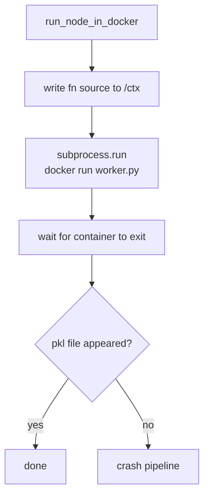
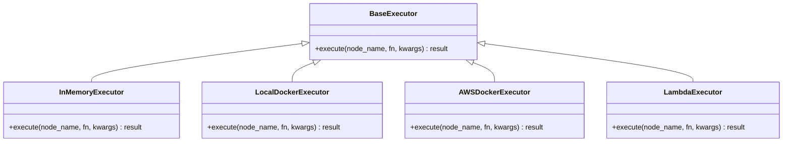
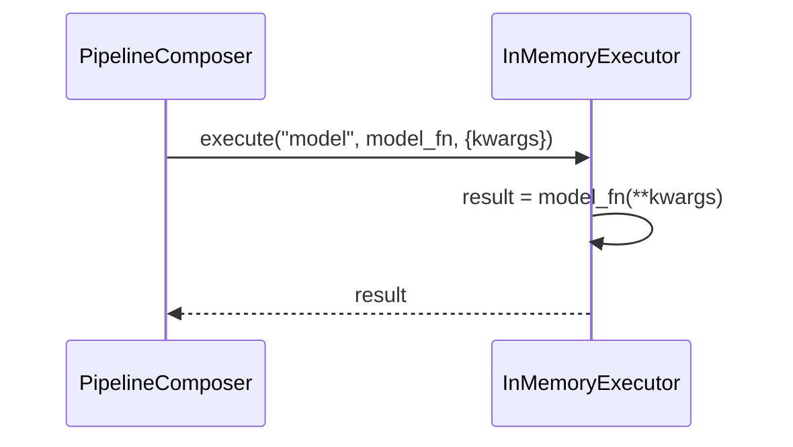
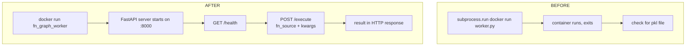
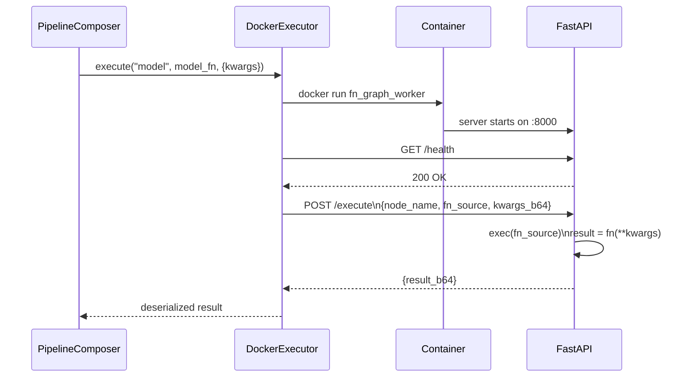
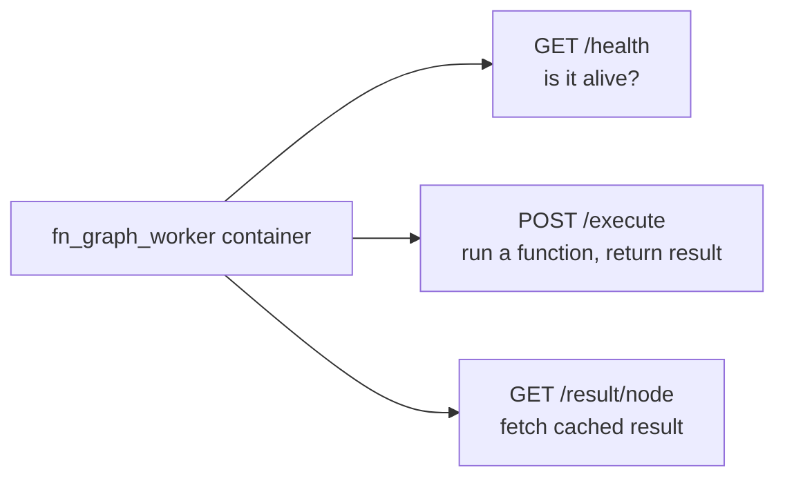
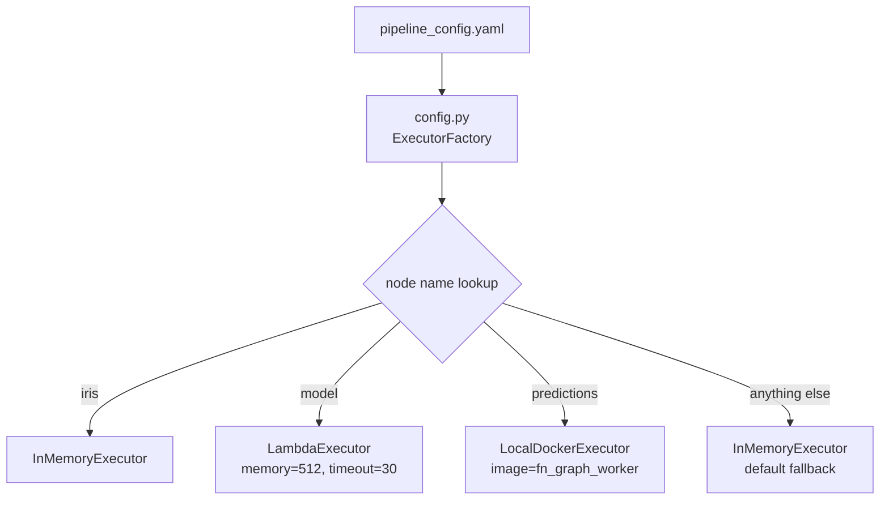
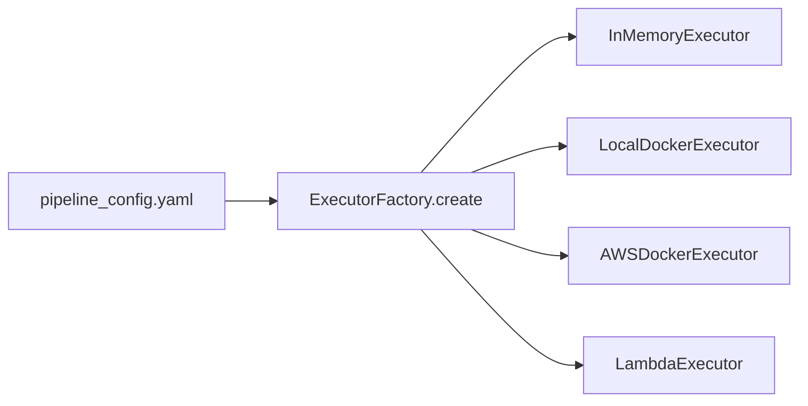
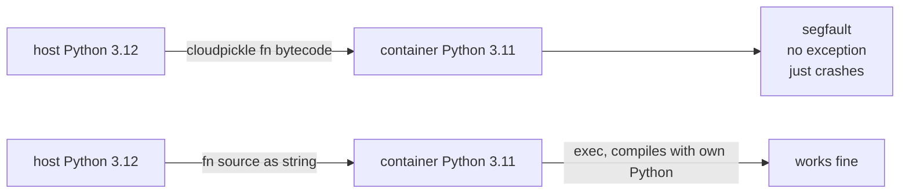

# 02 - Executor

## What the executor does

One job: given a function and its inputs, run it somewhere and return the result.


Where "somewhere" is decides by config. The composer never needs to know.

---

## Current execution model and its problems



Four problems:

- No health check before sending work. Container might not be ready.
- Failure is just an exit code. You grep logs to find out what happened.
- No in-memory fallback. Every test spins a container.
- Hardwired to Docker. Lambda means rewriting everything.

---

## Base interface



One method. Every variant implements it. The composer only ever calls this one method.

---

## InMemoryExecutor

Calls the function directly in the same Python process. No Docker, no network, no serialization.



Use this for local dev and unit tests. No overhead.

---

## DockerExecutor

The main redesign. Container no longer runs a one-shot script and dies. It runs a FastAPI server and waits for requests.



Full flow:



What the container exposes:



---

## Per-node executor config

Every node can run in a different environment. Configured in YAML.

```yaml
run_id: abc123

nodes:
  iris:
    executor: memory
  model:
    executor: lambda
    memory: 512
    timeout: 30
  predictions:
    executor: local_docker
    image: fn_graph_worker
  "*":
    executor: memory
```



Functions stay clean. No infrastructure config inside business logic. Switching a node from Lambda to Docker is one line in the YAML.

---

## Switching between executors



```python
executor = ExecutorFactory.create(config.get_node_config(node_name))
result = executor.execute(node_name, fn, kwargs)
```

---

## Why functions are shipped as source code not bytecode



Cloudpickle serializes a function including its bytecode. Bytecode format changes between Python versions. Shipping plain source text avoids this entirely. The container compiles it with its own Python.

---

## Key Notes

- Executor is per node, not per pipeline. Each node can run somewhere different.
- The `"*"` entry in config is the fallback. Any node not explicitly listed uses it.
- Source code shipping over HTTP preserves the same cross-version safety the current `worker.py` already had.
- LambdaExecutor posts to a Lambda function URL instead of a local Docker port. The handler logic inside Lambda and the FastAPI handler share the same function-execution core.
