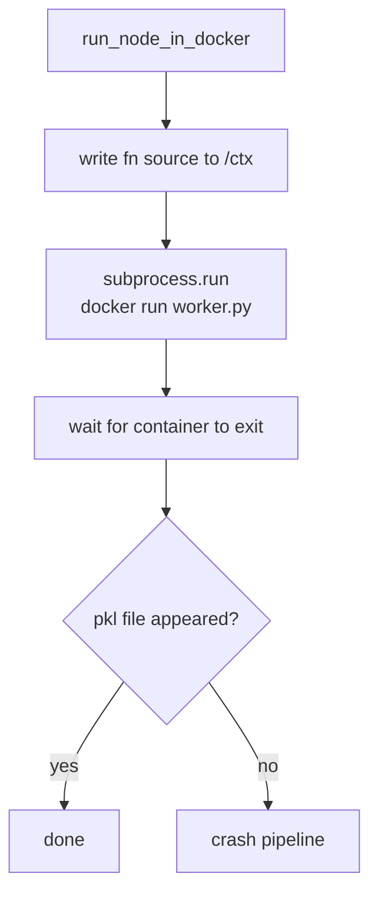
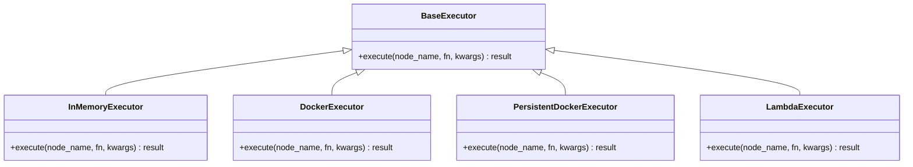
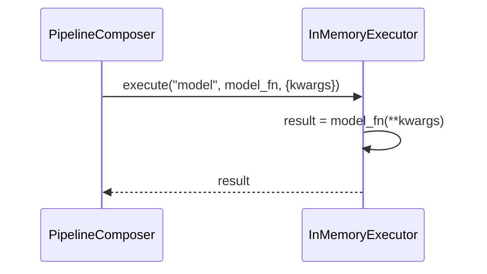
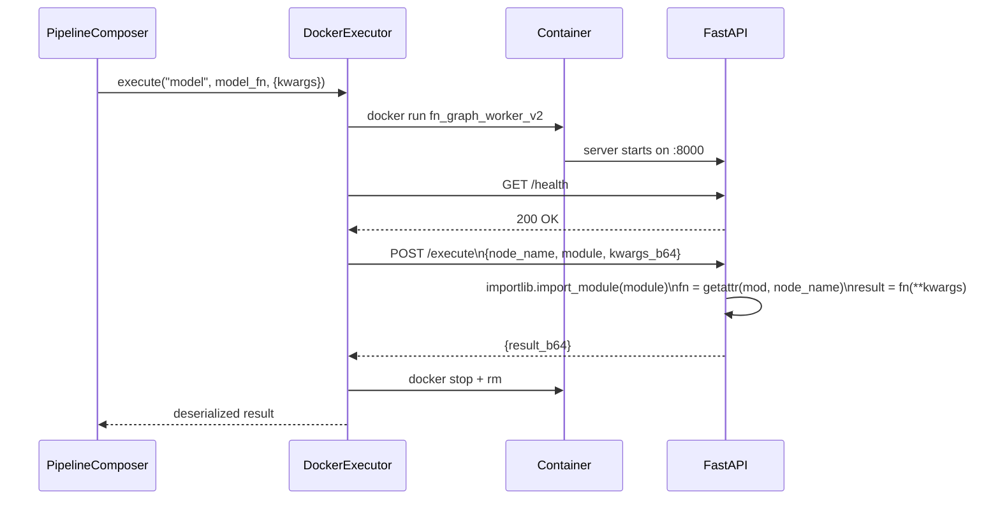
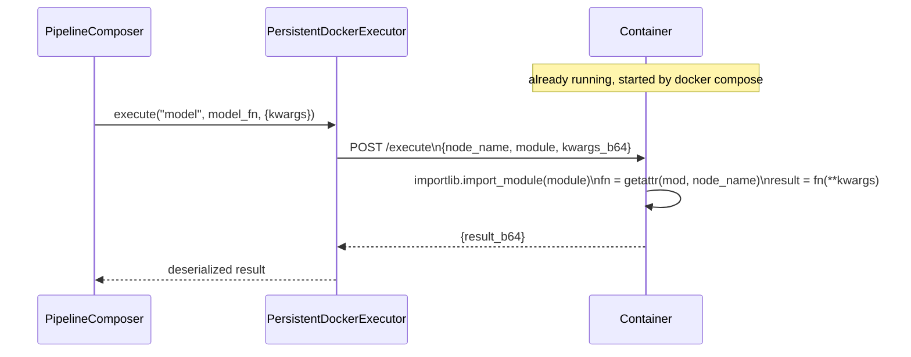
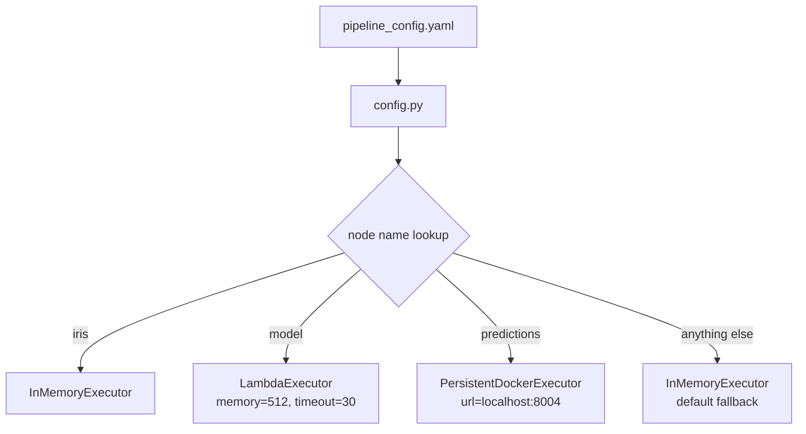
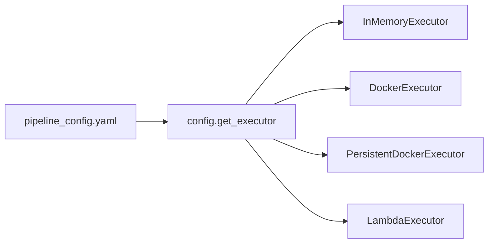

# 02 - Executor

## What the executor does

One job: given a function and its inputs, run it somewhere and return the result.


Where "somewhere" is decided by config. The composer never needs to know.

---

## Current execution model and its problems



Four problems:

- No health check before sending work. Container might not be ready.
- Failure is just an exit code. You grep logs to find out what happened.
- No in-memory fallback. Every test spins a container.
- Hardwired to Docker. Lambda means rewriting everything.

---

## Base interface



One method. Every variant implements it. The composer only ever calls this one method.

---

## InMemoryExecutor

Calls the function directly in the same Python process. No Docker, no network, no serialization.



Use this for local dev and unit tests. No overhead.

---

## DockerExecutor

Spins up a fresh container per node, sends work, tears it down when done.



**Cost:** one container boot per node. Acceptable for occasional heavy nodes. Expensive for many fast nodes.

---

## PersistentDockerExecutor

Containers are started once externally (via `docker compose up`) and stay running for the entire pipeline. No boot cost per node — just an HTTP call.



**Key difference from DockerExecutor:** the pipeline module is pre-installed inside the Docker image. The executor sends only the module path (`fn.__module__`) and node name — no source code over the wire, no `exec()`. The container resolves the function via `importlib.import_module` + `getattr`.

### Per-stage container isolation

Each pipeline stage can be routed to its own dedicated container:

```yaml
stages:
  preprocessing:
    executor: persistent_docker
    url: http://localhost:8001
    nodes: [iris, data, preprocess_data, investigate_data]

  training:
    executor: persistent_docker
    url: http://localhost:8003
    nodes: [model]
```

The corresponding `docker-compose-multi.yml` (in `deploy/`) defines one service per stage. Containers are started once before the pipeline run and torn down after.

### Worker contract

```
GET  /health               → { status: "ok" }
POST /execute              → { result_b64 }
     body: { node_name, module, kwargs_b64 }
```

---

## Per-node executor config

Every node can run in a different environment. Configured in YAML.

```yaml
run_id: abc123

nodes:
  iris:
    executor: memory
  model:
    executor: lambda
    memory: 512
    timeout: 30
  predictions:
    executor: persistent_docker
    url: http://localhost:8004
  "*":
    executor: memory
```



Functions stay clean. No infrastructure config inside business logic. Switching a node from Lambda to Docker is one line in the YAML.

---

## Switching between executors



```python
executor = get_executor(config.get_node_config(node_name))
result = executor.execute(node_name, fn, kwargs)
```

---

## Why functions are resolved by module import, not source shipping

```mermaid
flowchart LR
    A[executor] -->|POST /execute\nmodule + node_name| B[worker container]
    B -->|importlib.import_module| C[function from installed package]
    C --> D[fn(**kwargs)]
```

The pipeline module is baked into the Docker image at build time. The worker calls `importlib.import_module(module)` and `getattr(mod, node_name)` to retrieve the function. No source code travels over HTTP, no `exec()` runs in the container.

This is safer and simpler than the alternative (shipping source as a string):
- No cross-version bytecode issues
- No `exec()` security surface
- Functions have their correct `__module__` context at runtime
- Changing a function means rebuilding the image, not patching a string

---

## Key Notes

- Executor is per node, not per pipeline. Each node can run somewhere different.
- The `"*"` entry in config is the fallback. Any node not explicitly listed uses it.
- `DockerExecutor` and `PersistentDockerExecutor` both use the same worker image (`fn_graph_worker_v2`) and the same `/execute` HTTP contract. The difference is lifecycle: ephemeral vs persistent.
- `LambdaExecutor` posts to a Lambda function URL. The handler inside Lambda shares the same module-import execution model.
- Optional dependencies (`boto3` for Lambda/S3) are lazy-loaded — not required at startup unless that executor type is actually used.
