# 03 - Artifact Store

## What the artifact store does

Every node produces an output. The next node needs it. Something has to hold it in between.

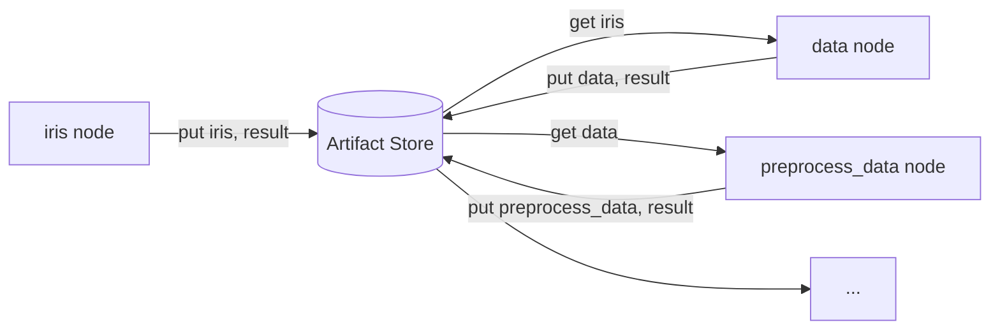

Right now that is a folder of pkl files on disk. Works locally. Breaks the moment two nodes run on different machines, different containers, or Lambda functions with no shared filesystem.

---

## Base interface

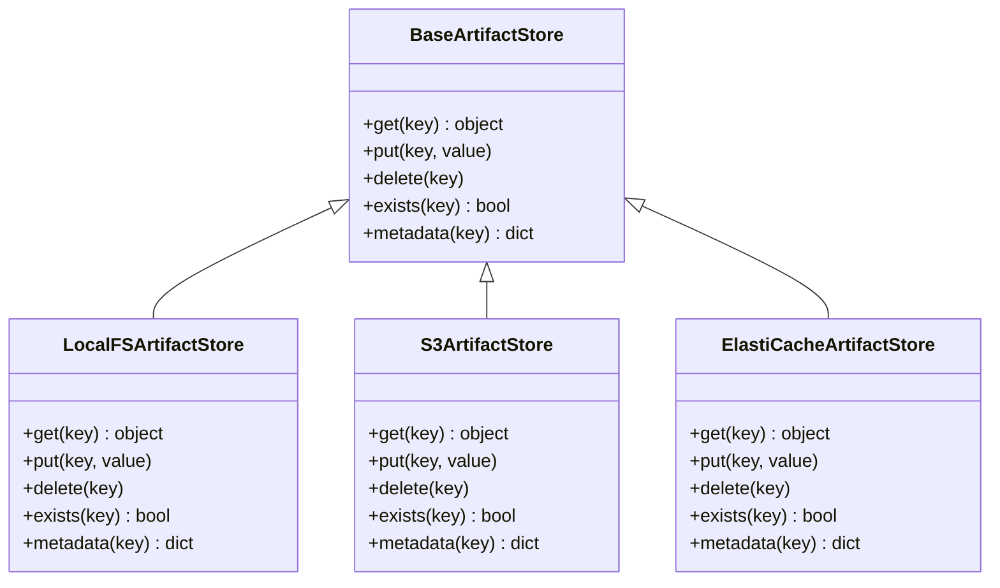

Five methods. Every backend implements these five. The composer only ever calls these five. Whether the data lands on disk or in S3 is invisible to everything else.

---

## Three backends

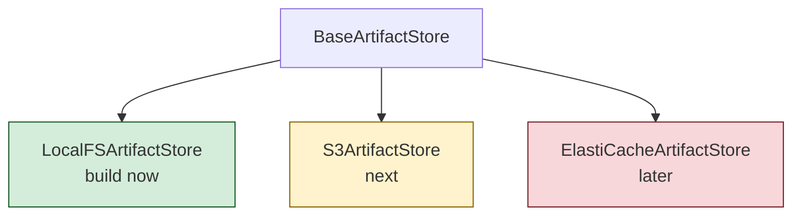

Get the interface right now. Adding S3 later is filling in those five methods. Nothing else changes.

---

## LocalFSArtifactStore

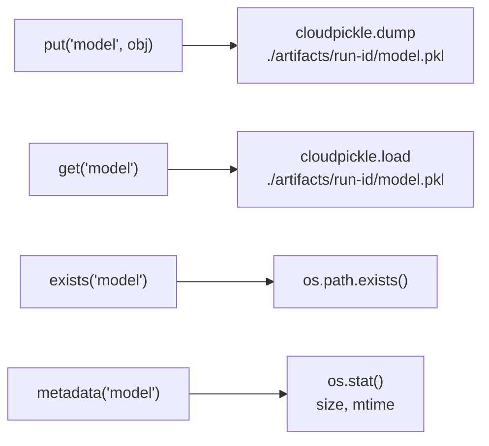

---

## S3ArtifactStore

Same interface, boto3 underneath.

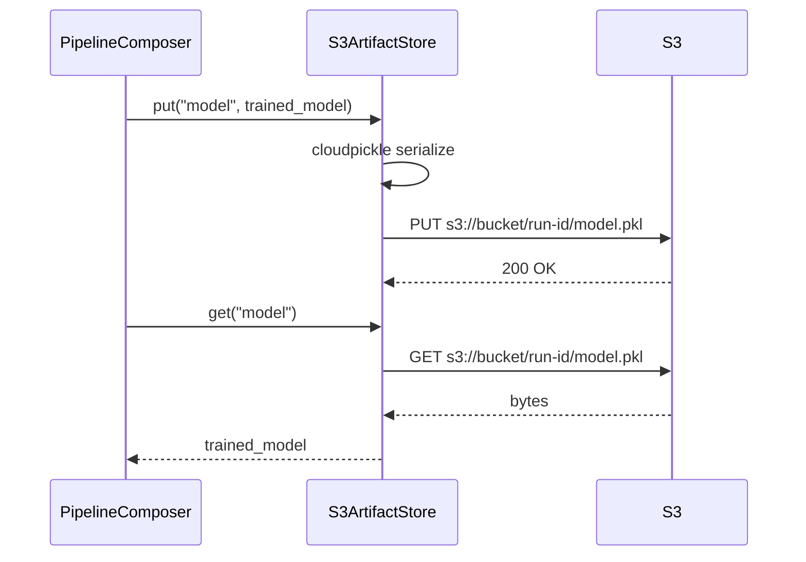

---

## Run IDs

Every pipeline run gets a unique ID. Artifacts are stored under it.

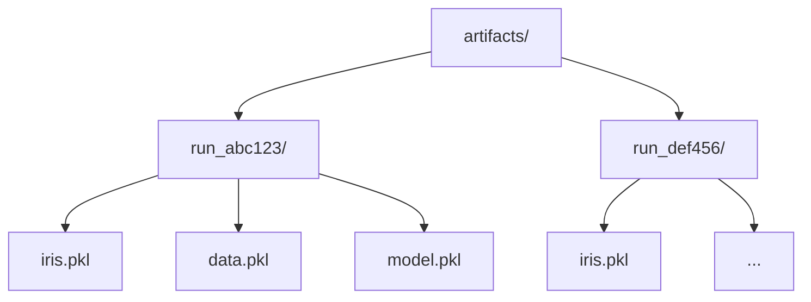

Multiple runs never overwrite each other. Debugging a failed run means reading its artifacts without touching the current one.

Pass the same `run_id` to reuse outputs from a previous run even if the executor changes.

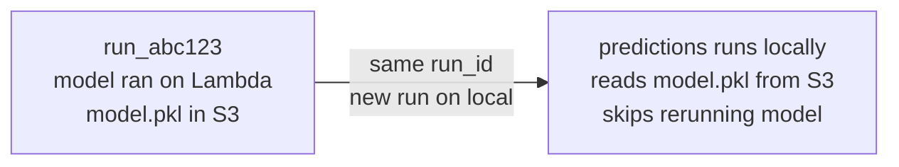

---

## Artifact path convention

Path is derived from convention, not config. Artifact store backend decides where files go based on the environment.

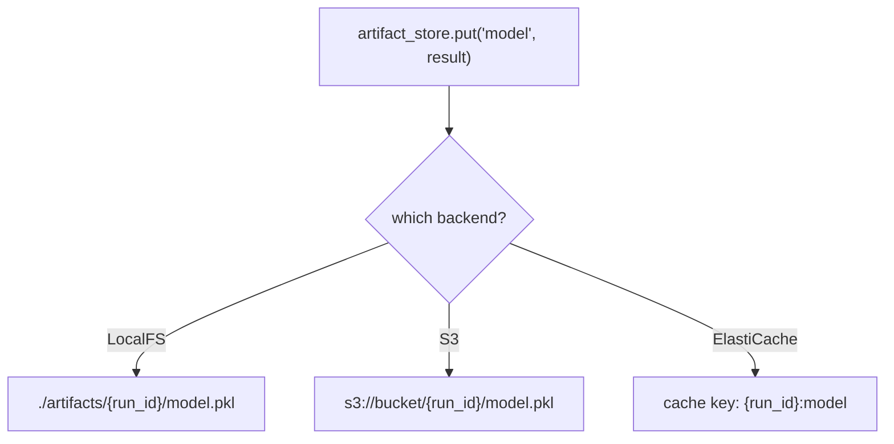

Same call everywhere. Backend resolves the physical location. No paths in config.

---

## Memoization

Before running any node, check if its output already exists.

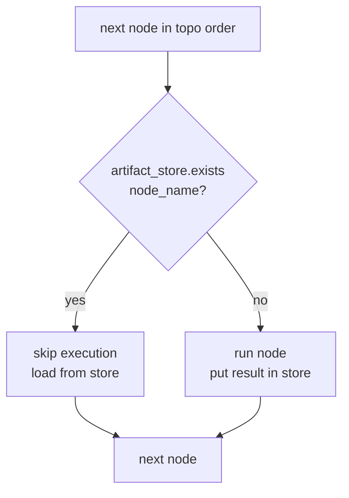

If a pipeline crashes at node 7 of 12, the next run with the same `run_id` picks up from node 8. Nodes that already succeeded are skipped because their artifacts exist.

---

## What gets written to the store (stage-based execution)

With stage partitioning, not every node writes to the store. Only two categories are persisted:

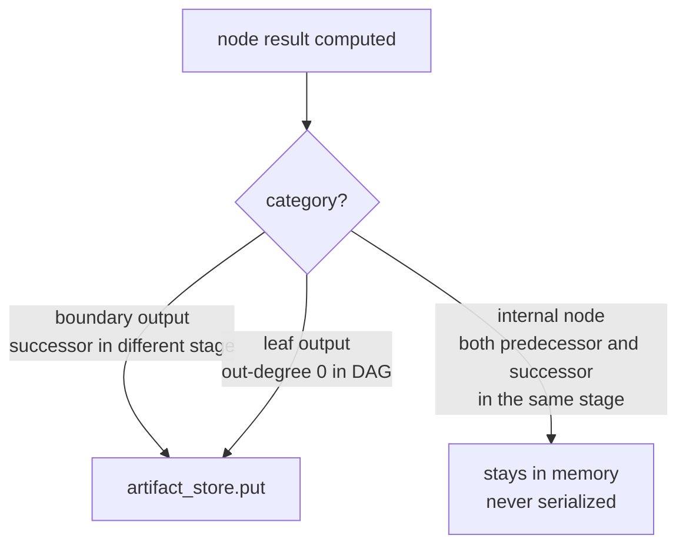

For a chain A → B → C within one stage where only C is consumed by the next stage: A and B produce zero pkl files. Only C is written to disk.

Pass `--debug-artifacts` to override this and persist every node — useful for inspecting intermediate results without modifying the pipeline or YAML.

---

## Switching backends

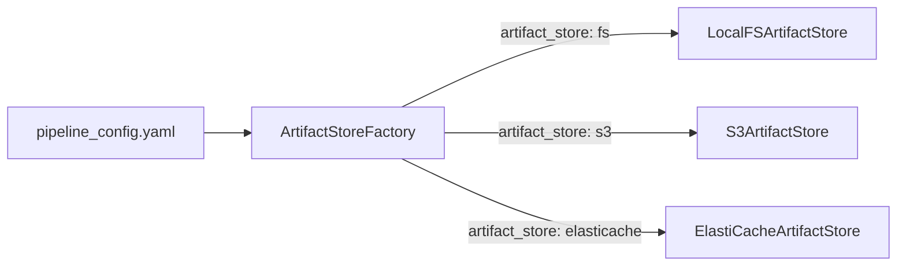

```yaml
artifact_store:
  default: s3
  bucket: my-pipeline-bucket
```

One setting for the whole pipeline. Artifact store is not per node. Executor is per node. These two are intentionally separate.

---

## Serialization

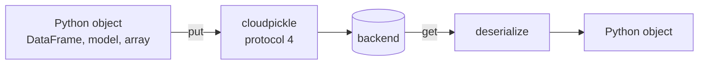

Protocol 4, not 5. Protocol 5 is Python 3.8+. If any environment runs an older version, protocol 5 breaks silently. Protocol 4 is safe across versions.

Lambda has a 6MB payload limit. Cloudpickle bytes from a large model can exceed that. When that becomes a real problem, the store swaps serialization per backend. Callers do not change.

---

## Key Notes

- Artifact store is one setting for the whole pipeline, not per node. Executor varies per node. Artifact store does not.
- `put()` writes atomically: temp file then rename. Never write in chunks without a finalization step. S3 `put_object` is atomic by default.
- `metadata()` returns artifact size. The orchestrator can use this to make routing decisions, for example not caching a 500MB model in ElastiCache which has a 1GB per-key limit.
- The `exists()` check is what makes resume and memoization work. Build this correctly from day one.
