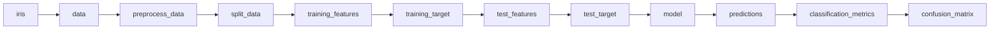
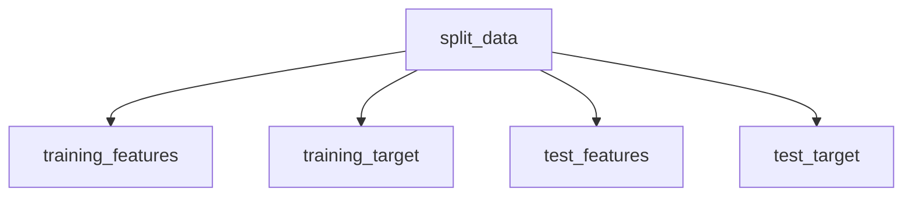
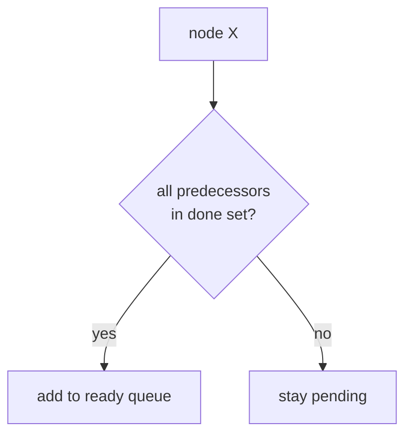
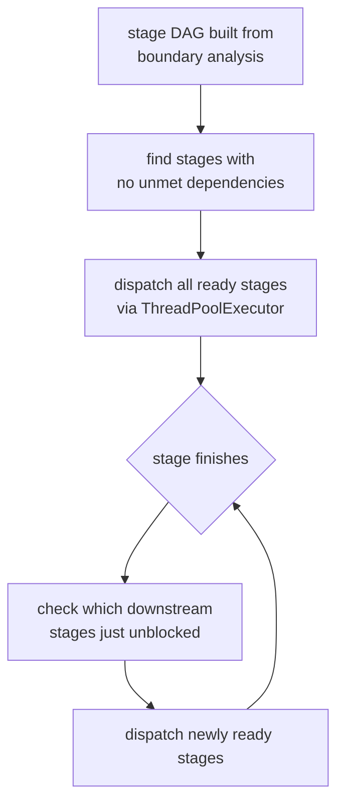
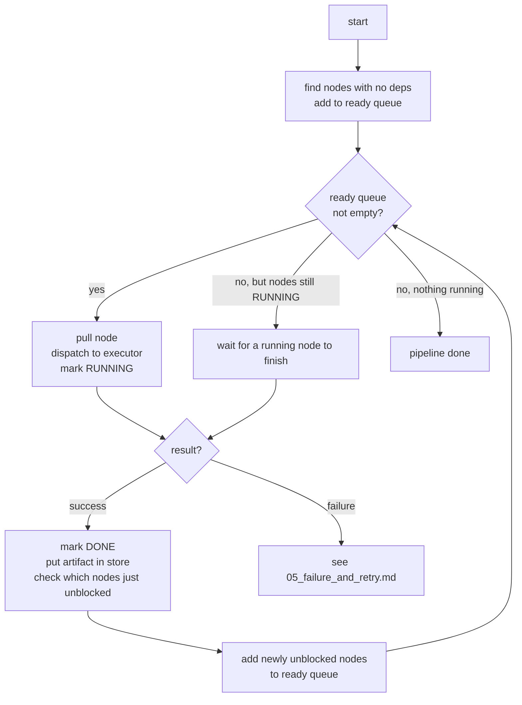
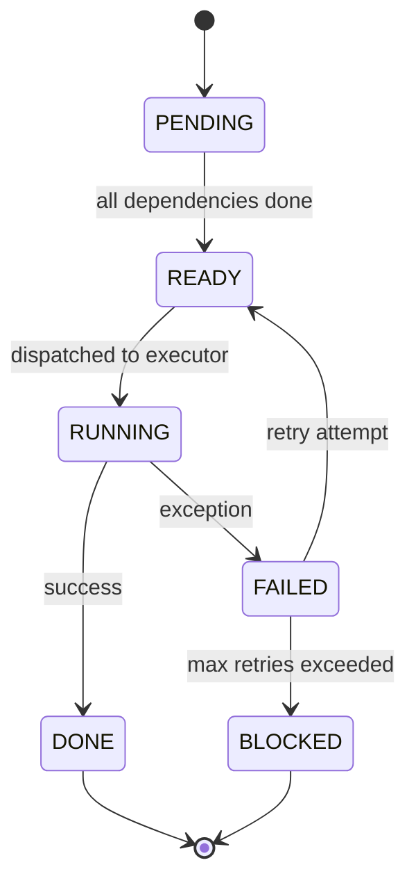
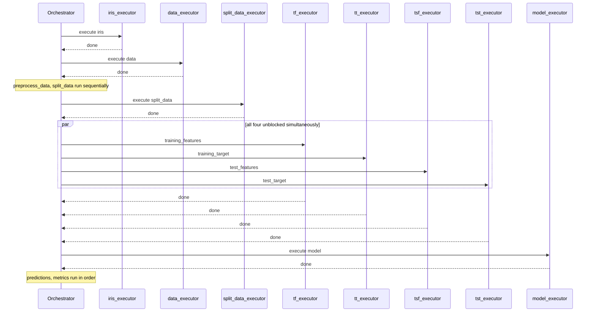
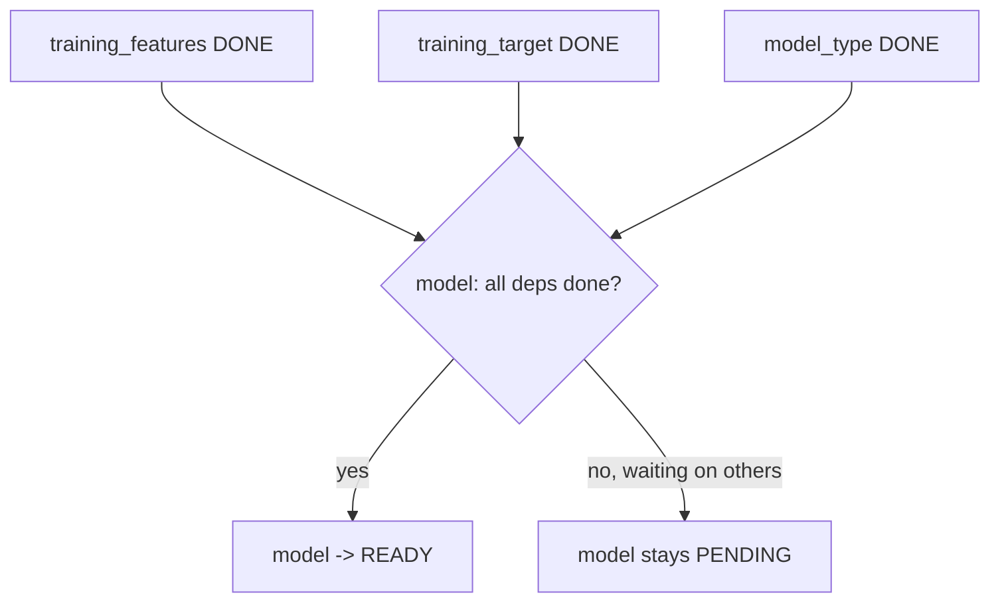

# 04 - Parallelism

## Two levels of parallelism

The system supports parallelism at two granularities:

1. **Stage-level parallelism** — independent stages dispatch simultaneously via `ThreadPoolExecutor`
2. **Node-level parallelism** — within a stage (or without stages), independent nodes run concurrently

Both are automatic. Neither requires manual configuration. The DAG decides.

---

## The problem with a simple loop

Right now nodes execute one at a time in a flat loop.

After `split_data` finishes, these four nodes have no dependency on each other:

In the current setup they run one after the other anyway. That is wasted time.

---

## How parallelism is detected

We do not configure parallelism manually. The DAG already tells us which nodes are independent. Any node whose dependencies are all in the done set can run immediately.

This is automatic for every pipeline, not just the iris example.

---

## Stage-level parallel dispatch

When stages are defined, the orchestrator builds a stage-level DAG from boundary node relationships. Independent stages dispatch simultaneously.

In the ML pipeline the stages are linear (preprocessing → splitting → training → evaluation), so they run sequentially. In a pipeline with independent branches, those branches would dispatch simultaneously.

---

## Node-level queue system

Within a stage (or when no stages are configured), the orchestrator runs a ready queue over individual nodes.

---

## Node states

Every node tracks its own state throughout the pipeline run.

---

## How the iris pipeline actually runs with parallelism

---

## Join condition

A node enters the ready queue only when every single one of its predecessors is in the done set. Not some. All.

---

## What parallel execution looks like in the iris pipeline

```mermaid
gantt
    title iris pipeline execution with parallelism
    dateFormat X
    axisFormat %s

    section sequential
    iris           :0, 1
    data           :1, 2
    preprocess     :2, 3
    split_data     :3, 4

    section parallel
    training_features :4, 5
    training_target   :4, 5
    test_features     :4, 5
    test_target       :4, 5

    section sequential
    model              :5, 6
    predictions        :6, 7

    section parallel
    classification_metrics :7, 8
    confusion_matrix       :7, 8
```

`classification_metrics` and `confusion_matrix` both depend only on `predictions` and `test_target`. They also run in parallel.

---

## Key Notes

- Parallelism is automatic at both stage and node level. Never configure it. The DAG decides.
- The join condition is strict: all predecessors must be DONE, not just started.
- Worker threads dispatch to executors. Each executor handles its own network call or subprocess independently.
- Artifact store must handle concurrent writes safely. LocalFS uses atomic rename. S3 `put_object` is atomic by default.
- Stage-level parallelism is coarser but reduces artifact store I/O — only boundary output nodes and leaf output nodes (final requested outputs) are persisted; all intra-stage intermediates stay in memory.
