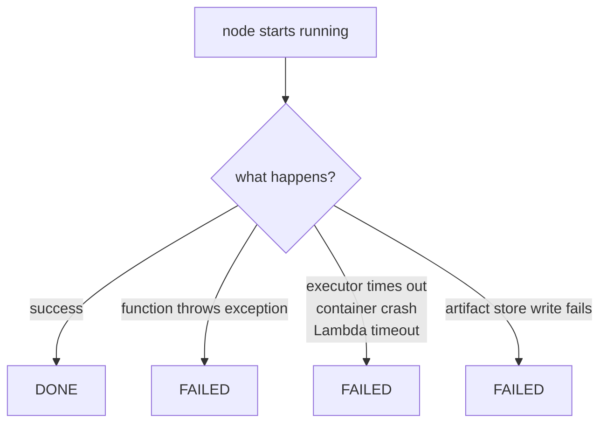
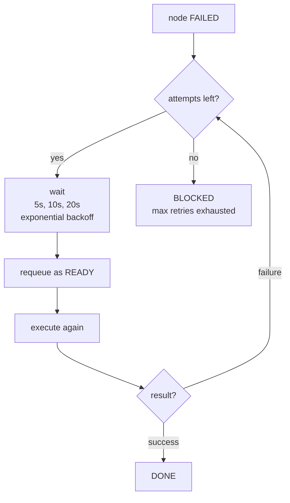
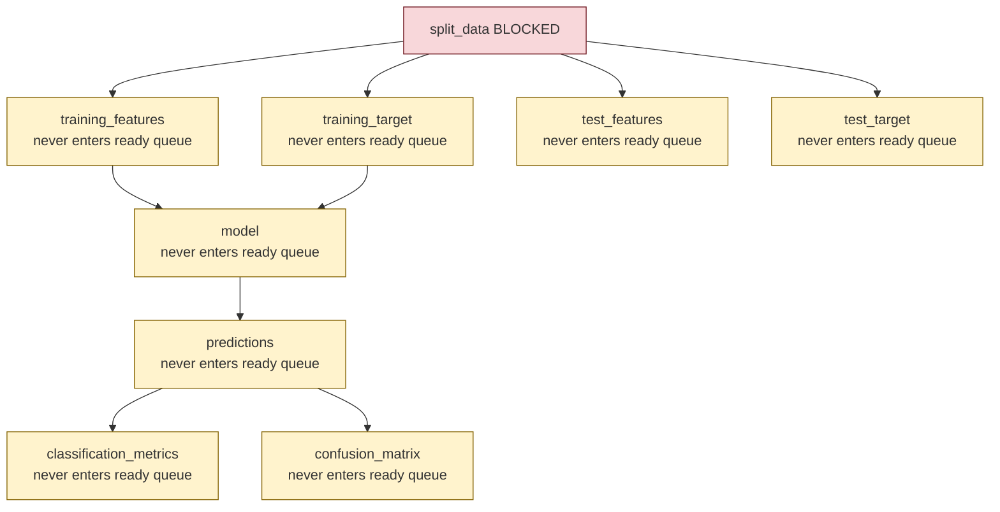
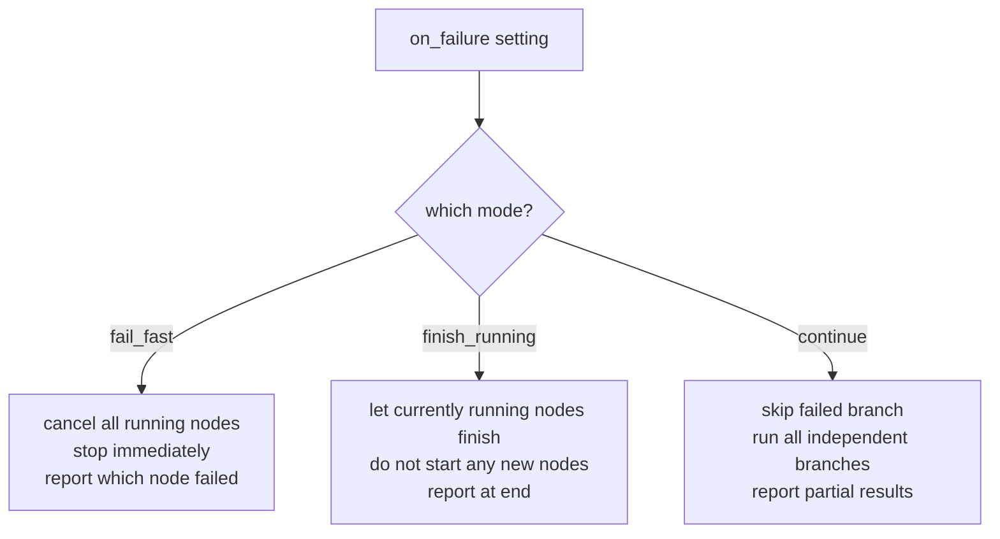
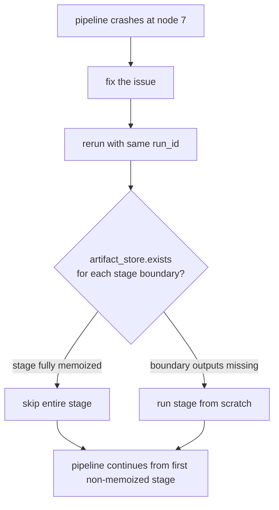
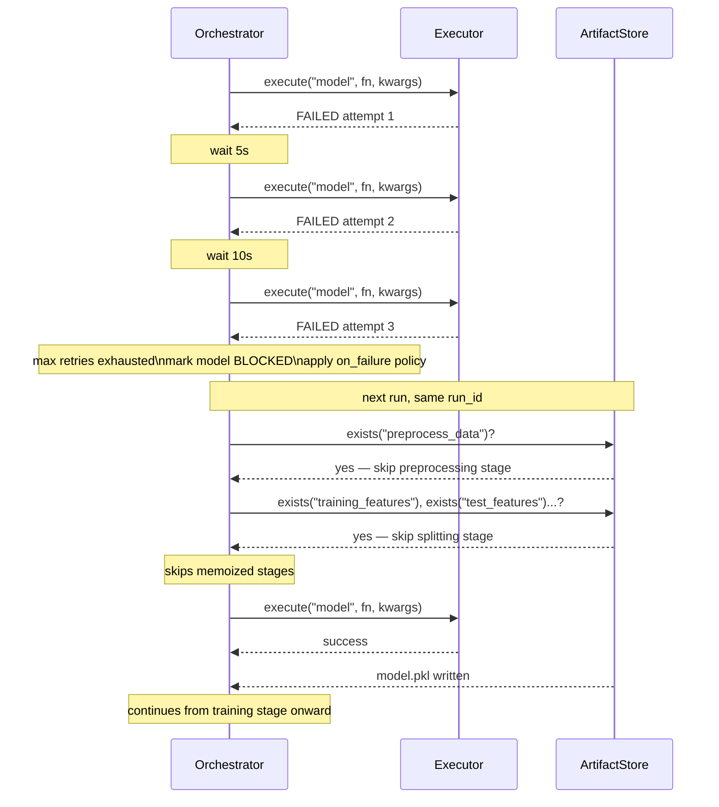
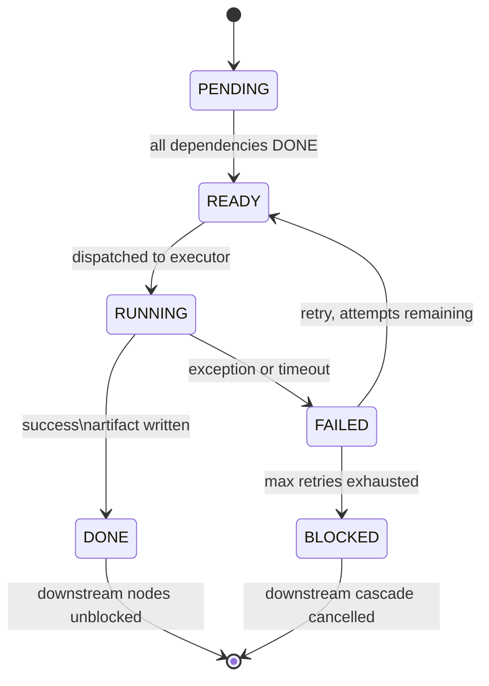

# 05 - Failure and Retry

## What can go wrong



All three map to the same FAILED state. The retry and failure logic handles them identically.

---

## Retry logic

Retry config lives per node in the YAML.

```yaml
nodes:
  model:
    executor: lambda
    retry:
      max_attempts: 3
      delay_seconds: 5
      backoff: exponential
```



Exponential backoff matters for Lambda and network calls. Immediate retry on a timeout will just timeout again.

---

## What happens to downstream nodes when a node is BLOCKED

They never enter the ready queue. The join condition requires all predecessors to be DONE. A BLOCKED node never reaches DONE. So everything downstream is implicitly cancelled.



Red: blocked. Yellow: implicitly cancelled. No special logic needed. Falls out naturally from the join condition.

---

## Pipeline-level failure behavior

What happens to the rest of the pipeline when a node is blocked is controlled by one setting.

```yaml
on_failure: fail_fast
```



When to use each:

- `fail_fast`: downstream results are meaningless without the failed node. Stop early, fix the issue.
- `finish_running`: some branches are independent and their results are still useful. Let them finish.
- `continue`: failed node is optional enrichment. Rest of the pipeline is still valid.

---

## Mid-pipeline resume

Because of memoization and run IDs, resume is free. No special logic.

With **stage-based execution**, resume is coarser but faster — an entire stage is skipped if all its boundary output nodes already exist in the artifact store. A single failed node in a stage means the whole stage re-runs on resume (only boundary outputs and leaf outputs are persisted; intra-stage progress is not saved).



---

## Full failure flow with retry and resume



---

## Node state transitions including failure



---

## Key Notes

- Retry config is per node. A Lambda function that frequently times out can have more retries than a local in-memory function that almost never fails.
- Downstream cancellation is automatic. No code needed to propagate failure. The join condition handles it.
- Resume is free because of memoization. Same run_id, artifacts that exist get skipped.
- With stages, resume granularity is per stage, not per node. A stage either fully re-runs or is fully skipped.
- `on_failure: continue` is useful when the pipeline has genuinely independent branches where partial results are still valuable.
- Always log which nodes were DONE, which were BLOCKED, and which were implicitly cancelled at the end of a failed run. Makes debugging fast.
