# 06 - Production Readiness

## Context

The design in docs 01-05 was built and validated against the iris ML pipeline: 12 lightweight nodes, small data, fast execution. The production target is 80 heavy CNN modules doing inference on chest X-ray datasets. That difference changes the picture significantly.

This doc covers what stands between the current design and production.

---

## What breaks first

### ~~Model loading per container~~ ✓ Addressed by PersistentDockerExecutor

The original problem: each container starts fresh, runs the function, exits. For a CNN checkpoint that is 200MB-2GB, loading from scratch per node per run means 40+ minutes of cold-start overhead before any real work happens.

**This is now addressed.** `PersistentDockerExecutor` routes work to pre-hosted long-running containers. Containers are started once via `docker compose up` and stay alive for the entire pipeline run — no boot cost per node, just an HTTP call. Models loaded once into GPU memory remain warm across all nodes routed to that container.

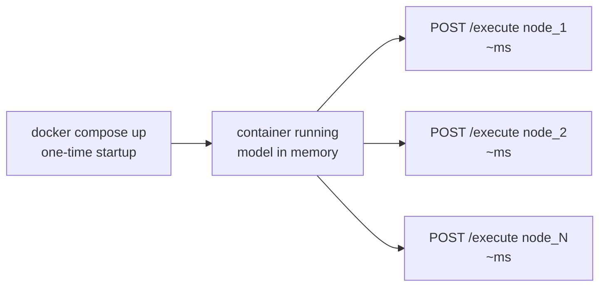

Each stage can be routed to its own dedicated container via `machine_learning_multi_persistent.yaml`. Multiple stages can share a container or have separate ones depending on isolation and resource needs.

### The pkl file assumption

Cloudpickle was designed for Python objects like DataFrames and sklearn models. CNN inference output is a tensor of shape `(batch, H, W, C)`. Chest X-rays are 2-50MB each. Across 80 nodes that is potentially hundreds of gigabytes of intermediate data sitting in pkl files.

Naive cloudpickle serialization on tensors is slow, memory-hungry, and will instantly hit Lambda's 6MB payload limit.

### Uncontrolled parallelism

The parallel queue dispatches all unblocked nodes simultaneously. With 80 CNN nodes and no resource awareness, all of them will compete for GPUs at once. The result is OOM crashes or severe thrashing.

---

## The remaining pieces

### 1. Resource-aware scheduler

The parallel queue has no concept of GPU or memory constraints. Every node needs to declare what it requires. Scheduler only dispatches when those resources are actually free.

```yaml
nodes:
  cnn_module_1:
    executor: persistent_docker
    url: http://localhost:8001
    resources:
      gpu: 1
      memory_gb: 16
  cnn_module_2:
    executor: persistent_docker
    url: http://localhost:8002
    resources:
      gpu: 2
      memory_gb: 32
```

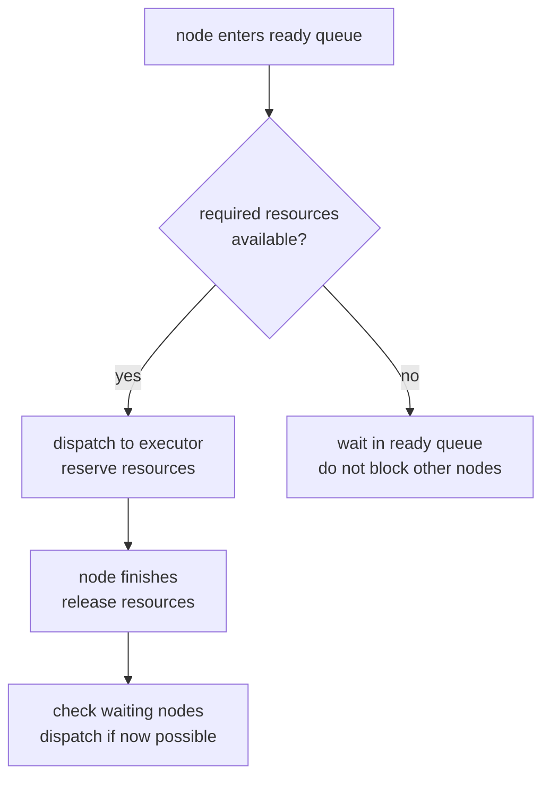

Without this, 80 CNN nodes dispatched simultaneously will crash the cluster.

---

### 2. Format-aware artifact serialization

Cloudpickle is the wrong tool for large tensors and model checkpoints. ArtifactStore needs pluggable serializers per artifact type.

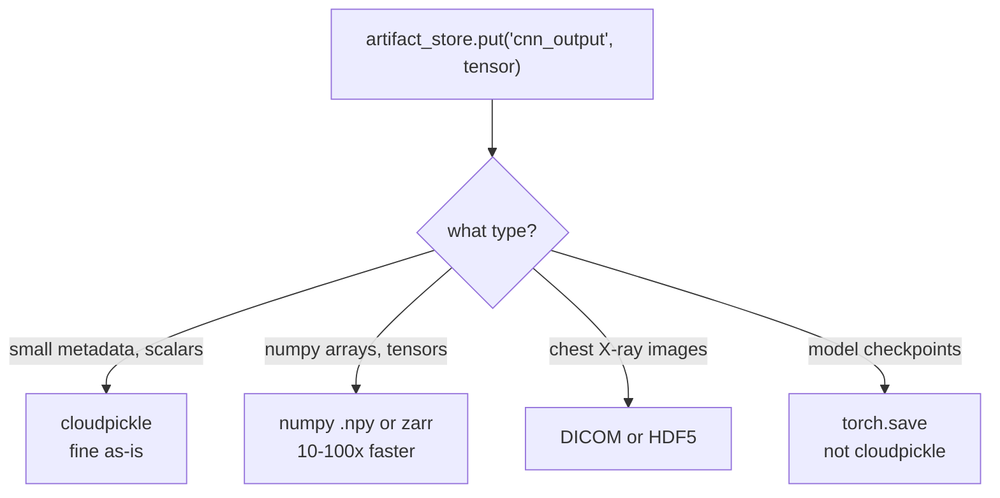

Declared per node in config:

```yaml
nodes:
  cnn_module_1:
    output_format: zarr
  preprocessing:
    output_format: dicom
```

---

### 3. Batch processing

Right now the pipeline processes one input at a time. 1000 chest X-rays through 80 CNN modules one by one is not viable. Need a batch dimension where the same DAG runs over N inputs with dynamic batching per node based on available GPU memory.

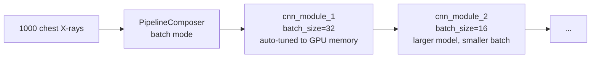

Each node declares its preferred batch size. Orchestrator manages batching and reassembling results.

---

### 4. Data lineage and audit trail

Medical imaging is regulated. Every output needs a full traceable history.

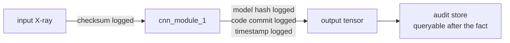

Run IDs alone are not enough. Need:
- Input data checksum per node
- Model checkpoint hash per run
- Code commit hash tied to each run
- Full query interface: "what produced this output?"

---

### 5. Observability

80 nodes, some on Lambda, some in persistent Docker containers, some retrying. Print statements scattered across container stdouts are not enough.

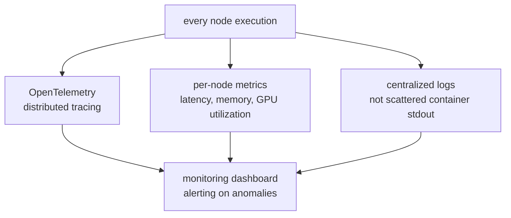

Specifically missing:
- Distributed tracing across nodes so you can see the full execution timeline in one place
- Per-node GPU utilization so you know which CNN modules are memory-bound
- Alerting when a node's latency spikes beyond a threshold

---

### 6. DAG partitioning by node weight

Lambda has a 15-minute timeout. Heavy CNN inference will exceed it. Some nodes belong on Lambda. Some belong on GPU EC2. The YAML config handles which executor per node, but right now that is manual.

Need automatic partitioning logic that groups nodes by compute profile and assigns executors accordingly.

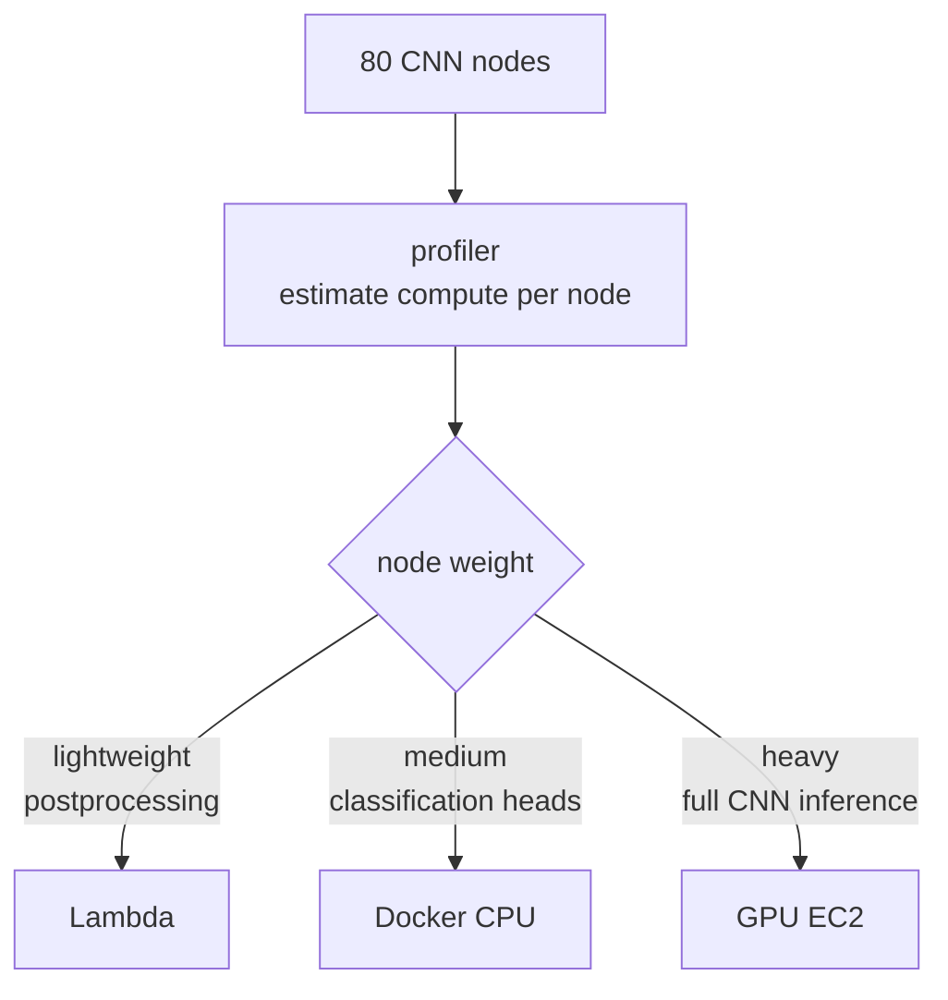

---

### 7. Schema validation between nodes

Right now nodes accept whatever the upstream node wrote. No validation. If CNN module 12 outputs shape `(batch, 512, 512, 1)` but module 13 expects `(batch, 256, 256, 3)`, the pipeline crashes deep inside inference with a cryptic shape mismatch.

Need output schema declared per node, validated by the artifact store on `put()` before the next node ever reads it.

```yaml
nodes:
  cnn_module_12:
    output_schema:
      type: tensor
      shape: [batch, 512, 512, 1]
      dtype: float32
```

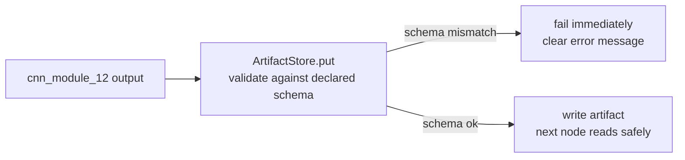

Catch shape mismatches at the boundary, not inside the next CNN module.

---

### 8. Secrets management

DICOM datasets, hospital S3 buckets, model registries. Containers and Lambda functions need credentials. No mechanism exists for this yet.

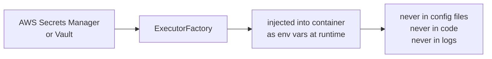

Credentials must never appear in the YAML config, in logs, or in artifact metadata.

---

### 9. Cost accounting

80 Lambda invocations per run, potentially hundreds of runs per day. No visibility into which nodes are expensive.

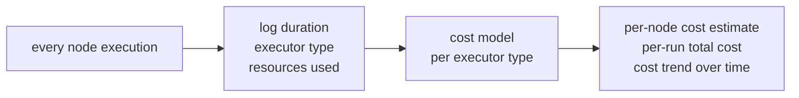

Without this, you have no way to know whether CNN module 34 costs $0.001 or $2.00 per run, or whether switching it from Lambda to EC2 saves money.

---

## Priority order

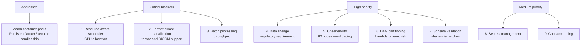

---

## Key Notes

- Docs 01-05 describe the correct architecture. Nothing in those docs needs to change. These items are additions on top of that foundation, not replacements.
- Items 1-3 should be scoped into the first production milestone. Skipping any of them means the pipeline will not complete a full run on real chest X-ray data.
- Data lineage (item 4) may be a hard regulatory requirement depending on how the pipeline outputs are used clinically. Confirm this early.
- `PersistentDockerExecutor` resolves the warm-container problem for Docker-based workloads. For Lambda, provisioned concurrency is the equivalent mechanism.
