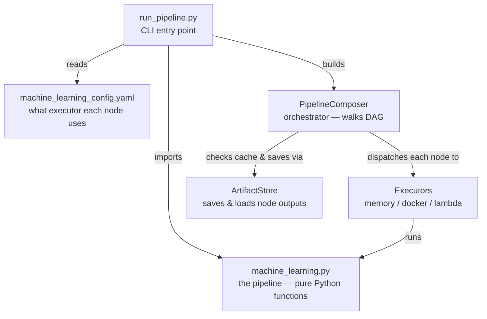
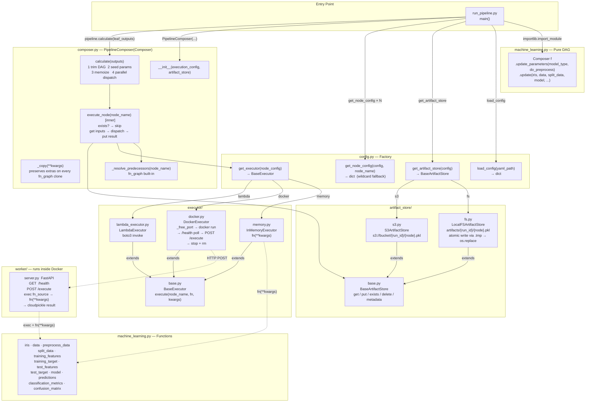
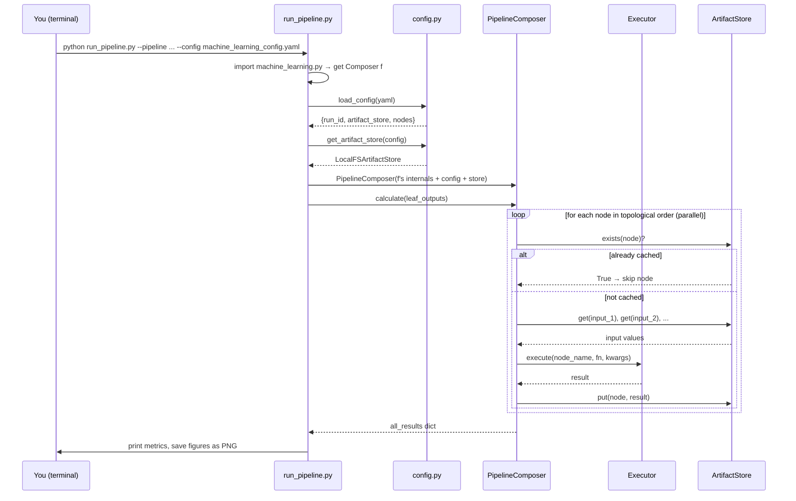
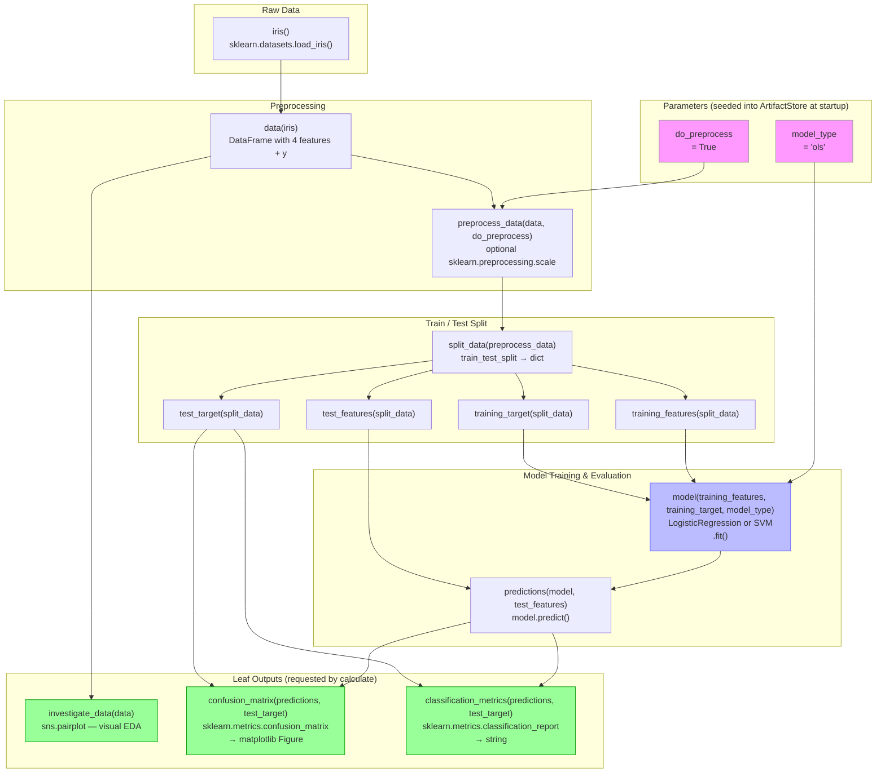
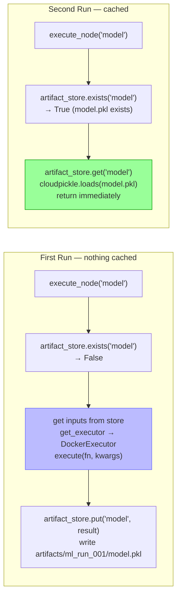
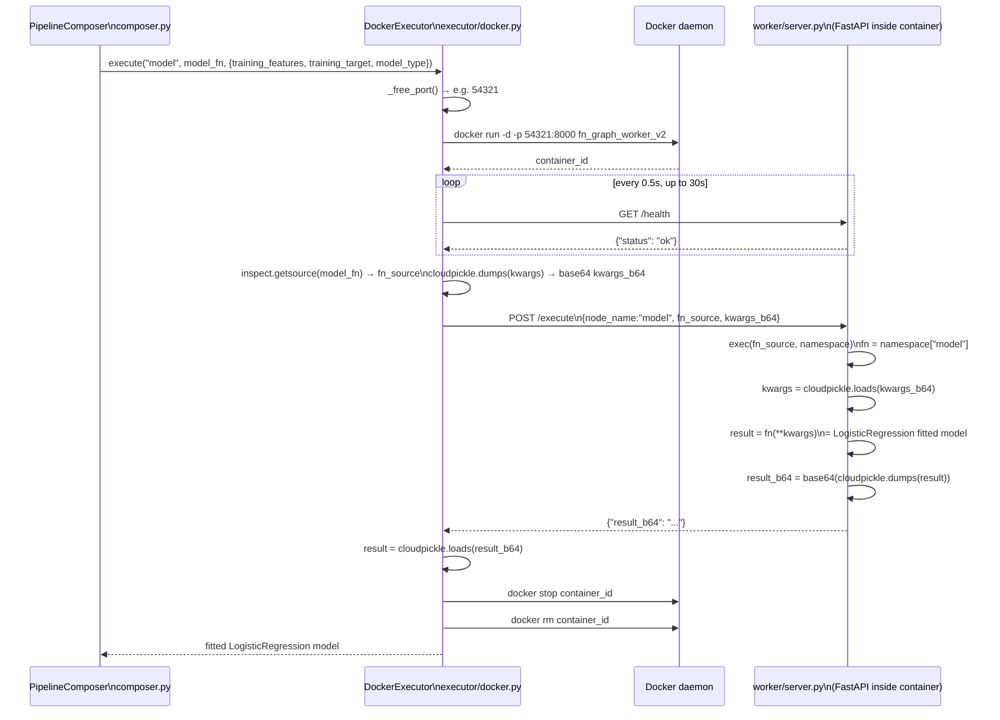
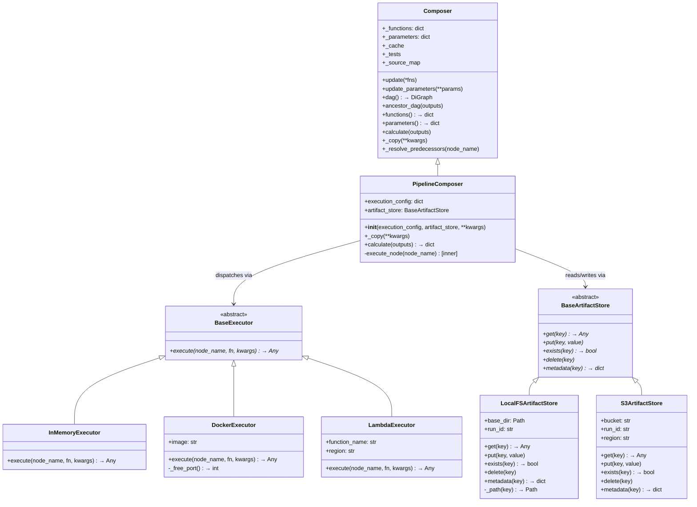
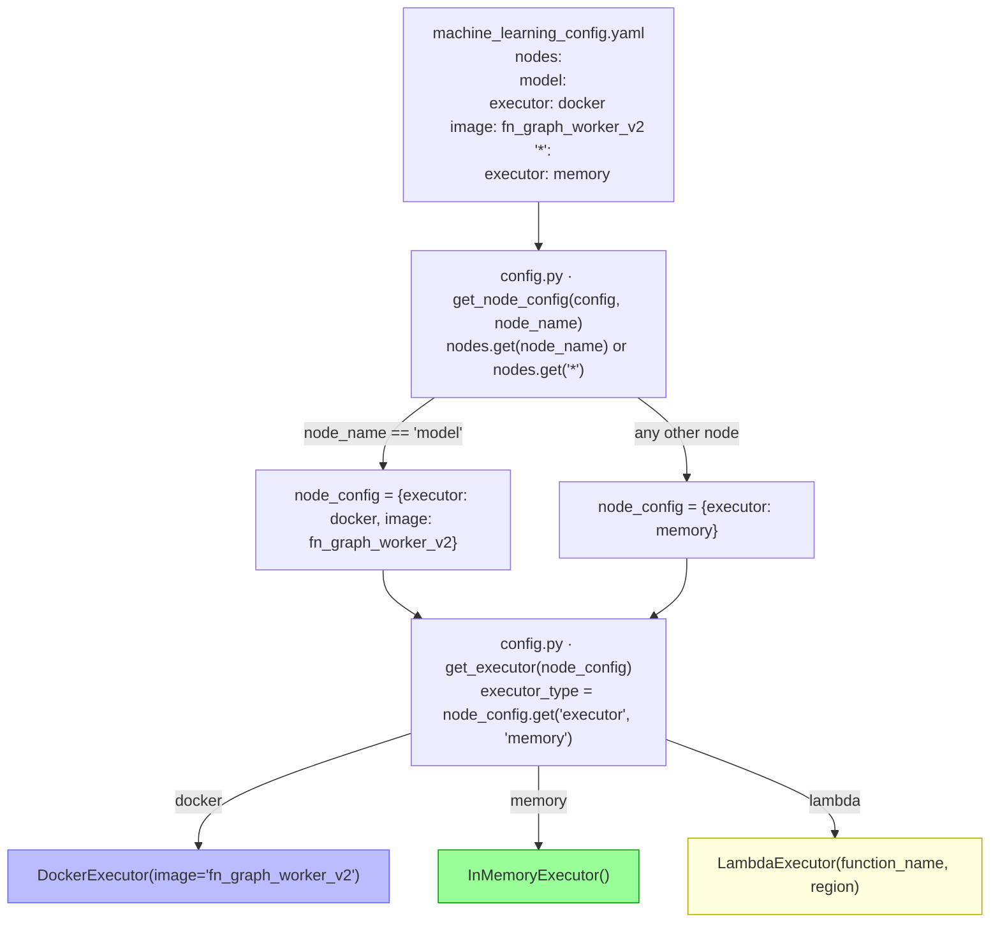

# fn_graph Pipeline — Visual Reference

All diagrams cover a full execution of the ML pipeline using `machine_learning_config.yaml`.

---

## Diagram 1 — Architecture: Simple

The five moving parts and how they relate.

> **One-liner:** The CLI wires together a config-driven orchestrator that walks the pipeline DAG, dispatching each node to the right executor and caching every result.

---

## Diagram 2 — Architecture: Detailed

Every file, class, and key method.

---

## Diagram 3 — Control & Data Flow: Simple

What happens when you run the CLI — one pass, easy to follow.

---

## Diagram 4 — Control & Data Flow: Detailed

Every method call, every decision, method names and file sources shown.

```mermaid
flowchart TD
    START(["terminal:\npython run_pipeline.py\n--pipeline fn_graph.examples.machine_learning\n--config machine_learning_config.yaml"])

    A1["run_pipeline.py · main()\nargparse: --pipeline, --config"]
    A2["importlib.import_module(pipeline)\n→ module.f  ← the plain Composer"]
    A3["config.py · load_config(yaml)\n→ {pipeline, artifact_store, nodes}"]
    A4["_setup_log(pipeline, run_id)\nopen logs/{pipeline}/{run_id}/{ts}.log\nsys.stdout = _Tee(stdout, log_file)"]
    A5["config.py · get_artifact_store(config)\ntype==fs → LocalFSArtifactStore(base_dir, run_id)"]
    A6["f.dag().nodes() → all_nodes\nfor each node: config.py · get_node_config(config, node)\n→ execution_config dict"]
    A7["PipelineComposer.__init__(\n  _functions, _parameters, _cache, _tests, _source_map,\n  execution_config, artifact_store\n)"]
    A8["pipeline.dag() → find leaf nodes\n[n for n if out_degree==0 and n not in params]\n→ [investigate_data, classification_metrics, confusion_matrix]"]

    B1["PipelineComposer.calculate(leaf_outputs)\nfuncs = self.functions()\nparams = {name: val for name,(_, val) in self.parameters().items()}"]
    B2["self.ancestor_dag(outputs)\n→ subgraph only of needed nodes\nnx.topological_sort(ancestor_dag) → topo_order"]
    B3["Seed params into ArtifactStore:\nfor name,val in params.items():\n  artifact_store.put(name, val)\n→ model_type.pkl, do_preprocess.pkl"]
    B4["Find initial ready nodes:\n[n for n in topo_order\n if all predecessors in params]\n→ [iris, ...]"]
    B5["ThreadPoolExecutor(max_workers=8)\nfuture_to_node = {pool.submit(execute_node, n): n for n in ready}"]

    C1["execute_node(node_name)  [inner fn]\nthread_id = threading.get_ident()"]
    C2{"artifact_store.exists(node_name)?\nLocalFSArtifactStore.exists()\n→ check artifacts/ml_run_001/{node}.pkl"}
    C3["CACHED PATH:\nartifact_store.get(node_name)\nLocalFSArtifactStore.get()\n→ cloudpickle.loads(path.read_bytes())\nreturn cached result"]
    C4["self._resolve_predecessors(node_name)\n→ [(param_name, predecessor_node), ...]\nkwargs = {param: artifact_store.get(node) for ...}"]
    C5["execution_config.get(node_name)\nor execution_config.get('*', {executor:memory})\nconfig.py · get_executor(node_config)"]

    D1["node_config executor == 'memory'\nInMemoryExecutor.execute(\n  node_name, fn, kwargs\n)\n→ fn(**kwargs)  directly in process"]
    D2["node_config executor == 'docker'\nDockerExecutor.execute(\n  node_name, fn, kwargs\n)"]
    D2a["_free_port() → random open port\ndocker run -d -p port:8000 fn_graph_worker_v2\n→ container_id"]
    D2b["poll GET http://localhost:port/health\nevery 0.5s up to 30s timeout"]
    D2c["inspect.getsource(fn) → fn_source\ncloudpickle.dumps(kwargs) → kwargs_b64\nPOST http://localhost:port/execute\n{node_name, fn_source, kwargs_b64}"]
    D2d["worker/server.py · POST /execute\nexec(fn_source, namespace)\nfn = namespace[node_name]\nkwargs = cloudpickle.loads(kwargs_b64)\nresult = fn(**kwargs)\nreturn {result_b64: cloudpickle.dumps(result)}"]
    D2e["DockerExecutor deserializes:\nresult = cloudpickle.loads(result_b64)\nfinally: docker stop + docker rm container"]

    E1["result = executor.execute(...)\nartifact_store.put(node_name, result)\nLocalFSArtifactStore.put():\n  write .tmp → os.replace → {node}.pkl"]
    E2["results[node_name] = result\ndone_set.add(node_name)\ncheck ancestor_dag.successors(node_name)"]
    E3["for downstream in successors:\n  if all predecessors in done_set:\n    pool.submit(execute_node, downstream)\n    → unblocks next wave"]

    F1["while future_to_node:\n  done_futures, _ = wait(FIRST_COMPLETED)\n  → repeat until all nodes done"]

    G1["return all_results\n{name: artifact_store.get(name)\n for name in funcs if exists}"]
    G2["run_pipeline.py:\nfor name, value in results.items():\n  str/float → print\n  Figure → value.savefig(name.png)\n  other → print type"]
    END(["done — check logs/ and artifacts/ and *.png"])

    START --> A1 --> A2 --> A3 --> A4 --> A5 --> A6 --> A7 --> A8
    A8 --> B1 --> B2 --> B3 --> B4 --> B5
    B5 --> C1 --> C2
    C2 -->|"True"| C3
    C2 -->|"False"| C4 --> C5
    C5 -->|"memory"| D1
    C5 -->|"docker"| D2 --> D2a --> D2b --> D2c --> D2d --> D2e
    D1 --> E1
    D2e --> E1
    E1 --> E2 --> E3 --> F1
    F1 -->|"more nodes"| C1
    F1 -->|"all done"| G1 --> G2 --> END
```

---

## Diagram 5 — The Machine Learning Pipeline DAG

The actual fn_graph DAG built by `machine_learning.py` — nodes are Python functions, edges are argument dependencies.

> Green = leaf outputs (what `run_pipeline.py` requests).  
> Purple = parameters (seeded directly into ArtifactStore, never executed as nodes).  
> Blue = the only node that runs in Docker per `machine_learning_config.yaml`.

---

## Diagram 6 — Parallel Execution Waves

How `ThreadPoolExecutor` + `wait(FIRST_COMPLETED)` achieves topology-aware parallelism — which nodes can fire simultaneously.

```mermaid
gantt
    title Parallel Execution Timeline (machine_learning_config.yaml)
    dateFormat  X
    axisFormat %s

    section Wave 0 (params seeded)
    model_type seeded       :done, 0, 1
    do_preprocess seeded    :done, 0, 1

    section Wave 1 (no computed deps)
    iris()                  :active, 1, 3

    section Wave 2 (iris done)
    data(iris)              :active, 3, 5

    section Wave 3 (data done)
    preprocess_data         :active, 5, 7
    investigate_data        :active, 5, 8

    section Wave 4 (preprocess done)
    split_data              :active, 7, 9

    section Wave 5 (split done — all 4 in parallel)
    training_features       :active, 9, 10
    training_target         :active, 9, 10
    test_features           :active, 9, 10
    test_target             :active, 9, 10

    section Wave 6 (all split outputs done)
    model [DOCKER]          :crit, 10, 15

    section Wave 7 (model done)
    predictions             :active, 15, 16

    section Wave 8 (predictions done — both in parallel)
    classification_metrics  :active, 16, 17
    confusion_matrix        :active, 16, 17
```

> `FIRST_COMPLETED` means: the moment any future finishes, its successors are immediately checked and dispatched if unblocked — no waiting for a whole wave to finish.

---

## Diagram 7 — Memoization: First Run vs Second Run

The `exists()` check is the only branch that matters for caching.

> To force a re-run of one node: `del artifacts/ml_run_001/model.pkl` — only `model` and its downstream nodes (`predictions`, `confusion_matrix`, `classification_metrics`) will re-execute.

---

## Diagram 8 — Docker Executor Lifecycle (for the `model` node)

Exactly what happens inside `DockerExecutor.execute()`.

---

## Diagram 9 — Class Hierarchy & Interfaces

The abstract contracts that make every component swappable.

---

## Diagram 10 — Config-Driven Executor Routing

How the YAML config maps to executor instances — showing the wildcard fallback logic.

---

## Quick Reference — File-to-Responsibility Map

| File | Class / Key Methods | Responsibility |
|---|---|---|
| `run_pipeline.py` | `main()`, `_setup_log()`, `_Tee` | CLI entry, logging, PipelineComposer construction |
| `composer.py` | `PipelineComposer.__init__`, `_copy`, `calculate`, `execute_node` | DAG walk, memoization, parallel dispatch |
| `config.py` | `load_config`, `get_executor`, `get_artifact_store`, `get_node_config` | YAML → object factory, wildcard resolution |
| `machine_learning.py` | `f = Composer().update_parameters().update(...)` | Pure pipeline definition — no infra knowledge |
| `executor/base.py` | `BaseExecutor.execute` | Abstract contract for all executors |
| `executor/memory.py` | `InMemoryExecutor.execute` | `fn(**kwargs)` directly in process |
| `executor/docker.py` | `DockerExecutor.execute`, `_free_port` | Spin container → health poll → HTTP POST → stop |
| `executor/lambda_executor.py` | `LambdaExecutor.execute` | boto3 invoke → deserialize |
| `artifact_store/base.py` | `BaseArtifactStore` | Abstract contract: get/put/exists/delete/metadata |
| `artifact_store/fs.py` | `LocalFSArtifactStore`, `_path`, `put` (atomic) | `artifacts/{run_id}/{node}.pkl` via cloudpickle |
| `artifact_store/s3.py` | `S3ArtifactStore` | Same interface, S3 backend |
| `worker/server.py` | `GET /health`, `POST /execute` | FastAPI inside Docker: exec fn_source, return result |
| `machine_learning_config.yaml` | `run_id`, `artifact_store`, `nodes` | Runtime wiring — change executor without touching Python |
