# fn_graph Pipeline — Visual Reference

All diagrams cover a full execution of the ML pipeline using `machine_learning_config.yaml`.

---

## Diagram 1 — Architecture: Simple

The six moving parts and how they relate.

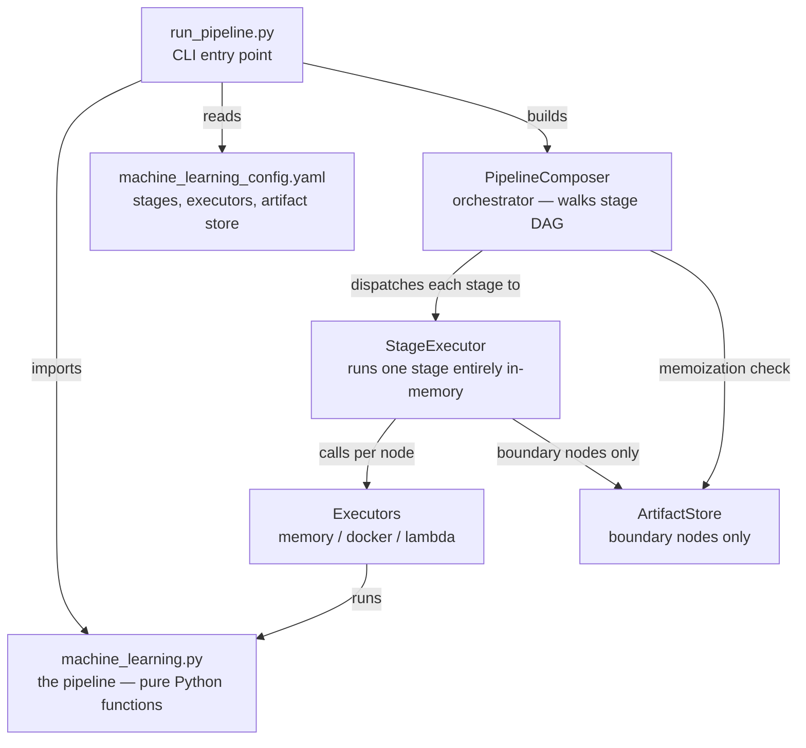

> **One-liner:** The CLI builds an orchestrator that groups nodes into stages, dispatches independent stages in parallel, and only touches disk at stage boundaries — not between every node.

---

## Diagram 2 — Architecture: Detailed

Every file, class, and key method.

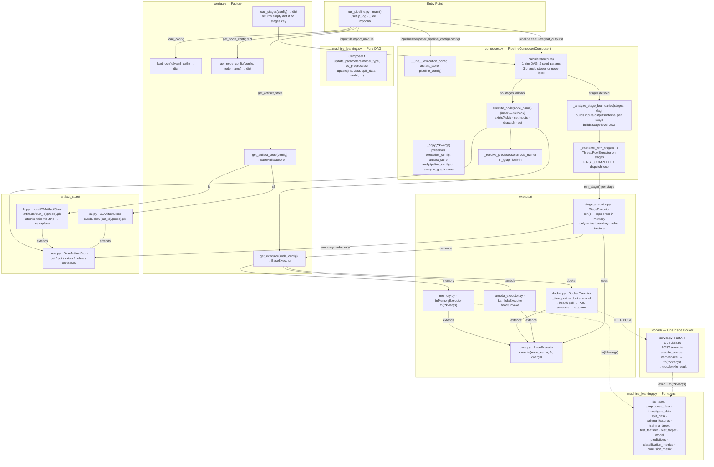

---

## Diagram 3 — Control & Data Flow: Simple (Stage-Based)

What happens when you run the CLI with stages defined — one pass, easy to follow.

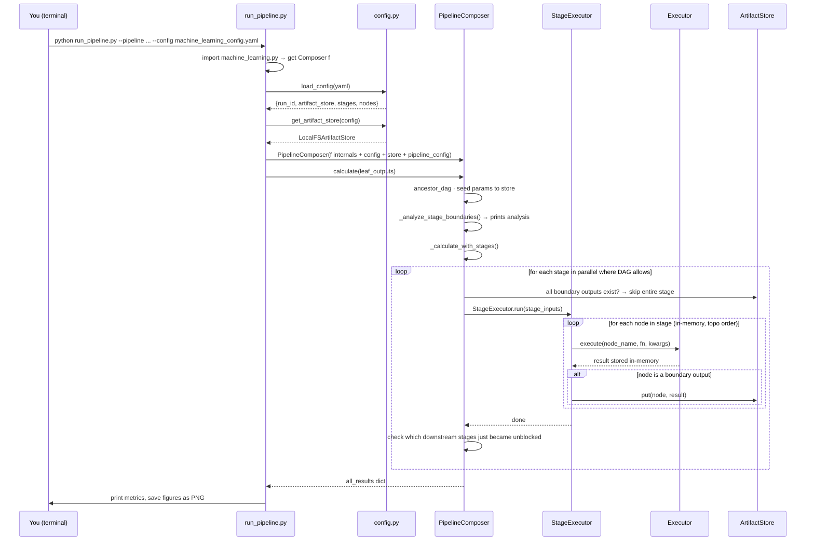

---

## Diagram 4 — Control & Data Flow: Detailed

Every method call and decision, including the stage branch.

```mermaid
flowchart TD
    START(["terminal:\npython run_pipeline.py\n--pipeline fn_graph.examples.machine_learning\n--config machine_learning_config.yaml"])

    A1["run_pipeline.py · main()\nargparse: --pipeline, --config"]
    A2["importlib.import_module(pipeline)\n→ module.f  the plain Composer"]
    A3["config.py · load_config(yaml)\n→ {pipeline, artifact_store, stages, nodes}"]
    A4["_setup_log(pipeline, run_id)\nopen logs/{pipeline}/{run_id}/{ts}.log\nsys.stdout = _Tee(stdout, log_file)"]
    A5["config.py · get_artifact_store(config)\ntype==fs → LocalFSArtifactStore(base_dir, run_id)"]
    A6["f.dag().nodes() → all_nodes\nfor each node: get_node_config → execution_config dict"]
    A7["PipelineComposer.__init__(\n  _functions, _parameters, _cache, _tests, _source_map,\n  execution_config, artifact_store, pipeline_config\n)"]
    A8["pipeline.dag() → find leaf nodes\nout_degree==0 and not in params\n→ [investigate_data, classification_metrics, confusion_matrix]"]

    B1["PipelineComposer.calculate(leaf_outputs)\nfuncs = self.functions()\nparams = {name: val ...}"]
    B2["self.ancestor_dag(outputs)\nnx.topological_sort → topo_order"]
    B3["seed params into ArtifactStore\nartifact_store.put(name, val) for each param\n→ model_type.pkl, do_preprocess.pkl"]
    BRANCH{"load_stages(self._config)\nstages defined?"}

    STAGE1["_analyze_stage_boundaries(stages, ancestor_dag)\nbuild node_to_stage map\nfor each stage: find inputs, outputs, internal\nbuild stage-level NetworkX DiGraph\nprint analysis"]
    STAGE2["_calculate_with_stages(...)\nready_stages = stages with in_degree==0\nThreadPoolExecutor(max_workers=4)"]
    STAGE3["run_stage(stage_name)\nmemoized? all boundary outputs exist → skip\nload stage inputs from artifact store\nStageExecutor.run()"]
    STAGE4["StageExecutor.run()\ntopo sort stage nodes\nfor each node:\n  _resolve_predecessors → load from in-memory dict\n  get_executor(stage_def) → executor\n  executor.execute(node_name, fn, kwargs)\n  store result in-memory\n  if boundary node: artifact_store.put()"]
    STAGE5["wait(FIRST_COMPLETED)\nfor finished stage: done_stages.add()\ncheck stage_dag.successors\nif all pred stages done → submit downstream stage"]

    NODE1["Find initial ready nodes\n[n in topo_order if all preds in params]"]
    NODE2["ThreadPoolExecutor(max_workers=8)\nsubmit all ready nodes"]
    NODE3["execute_node(node_name)\nartifact_store.exists? → skip\n_resolve_predecessors → load kwargs from store\nget_executor → executor.execute(fn, kwargs)\nartifact_store.put(result)"]
    NODE4["wait(FIRST_COMPLETED)\ndone_set.add(node)\ncheck successors → submit unblocked nodes"]

    D2["DockerExecutor.execute()\n_free_port → docker run -d\npoll /health → POST /execute\ncloudpickle result ← HTTP response\ndocker stop + rm"]
    D3["worker/server.py\nexec(fn_source, namespace)\nfn(**kwargs) → result\nreturn result_b64"]

    G1["return all_results\n{name: artifact_store.get(name) for name in funcs if exists}"]
    G2["run_pipeline.py:\nstr/float → print\nFigure → savefig(name.png)"]
    END(["done — check logs/ artifacts/ *.png"])

    START --> A1 --> A2 --> A3 --> A4 --> A5 --> A6 --> A7 --> A8
    A8 --> B1 --> B2 --> B3 --> BRANCH

    BRANCH -->|"yes — stages defined"| STAGE1
    STAGE1 --> STAGE2 --> STAGE3 --> STAGE4
    STAGE4 -.->|"docker node"| D2 --> D3
    STAGE4 --> STAGE5
    STAGE5 -->|"more stages"| STAGE3
    STAGE5 -->|"all stages done"| G1

    BRANCH -->|"no — node-level fallback"| NODE1
    NODE1 --> NODE2 --> NODE3
    NODE3 -.->|"docker node"| D2
    NODE3 --> NODE4
    NODE4 -->|"more nodes"| NODE3
    NODE4 -->|"all done"| G1

    G1 --> G2 --> END
```

---

## Diagram 5 — The Machine Learning Pipeline DAG with Stage Grouping

The fn_graph DAG with stage boundaries overlaid. Node colours show which stage each belongs to.

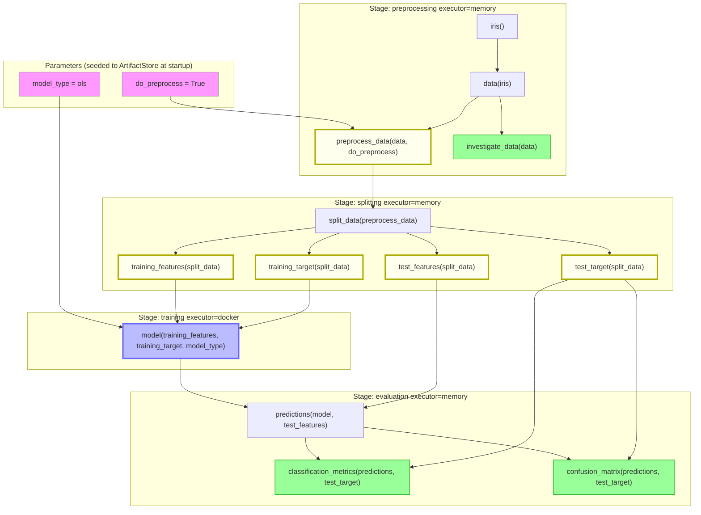

> **Thick borders** = boundary nodes (written to ArtifactStore).  
> `preprocess_data` → boundary between preprocessing and splitting.  
> `training_features`, `training_target`, `test_features`, `test_target` → boundary between splitting and training/evaluation.  
> `model` → boundary between training and evaluation.  
> Green = leaf outputs. Blue = runs in Docker.

---

## Diagram 6 — Stage-Level Execution Timeline

What actually runs and when. Within each stage, nodes are sequential (StageExecutor runs in topo order). Parallelism is between independent stages.

```mermaid
gantt
    title Stage Execution Timeline (machine_learning_config.yaml)
    dateFormat  X
    axisFormat %s

    section Params (seeded to store)
    model_type, do_preprocess     :done, 0, 1

    section Stage: preprocessing (memory)
    iris                          :active, 1, 2
    data                          :active, 2, 3
    preprocess_data + investigate_data :active, 3, 5
    WRITE preprocess_data to store :done, 5, 5

    section Stage: splitting (memory)
    split_data                    :active, 5, 6
    training_features             :active, 6, 7
    training_target               :active, 7, 8
    test_features                 :active, 8, 9
    test_target                   :active, 9, 10
    WRITE all 4 split outputs to store :done, 10, 10

    section Stage: training (docker)
    model - docker run + health poll :crit, 10, 13
    POST /execute - fit LogisticRegression :crit, 13, 16
    docker stop + rm              :crit, 16, 17
    WRITE model to store          :done, 17, 17

    section Stage: evaluation (memory)
    predictions                   :active, 17, 18
    classification_metrics        :active, 18, 19
    confusion_matrix              :active, 18, 19
```

> In the ML pipeline the stage DAG is a straight chain so stages run sequentially. The parallel dispatch infrastructure is in place — if two stages had no dependency between them they would fire simultaneously.

---

## Diagram 7 — Memoization: Stage-Level (First Run vs Second Run)

Memoization now operates at the **stage** level. An entire stage is skipped if all its boundary output nodes already exist in the artifact store.

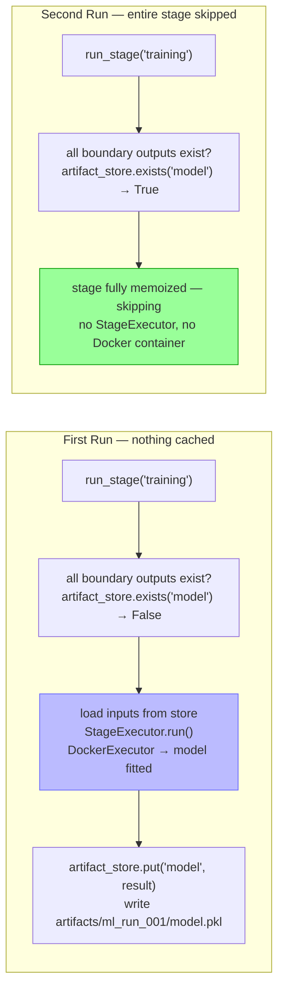

> To re-run one stage: delete its boundary output artifacts.  
> `del artifacts\ml_run_001\model.pkl` → training stage re-runs, evaluation re-runs downstream.  
> preprocessing and splitting stay cached.

---

## Diagram 8 — Docker Executor Lifecycle (for the `model` node)

Exactly what happens inside `DockerExecutor.execute()` — called from StageExecutor during the training stage.

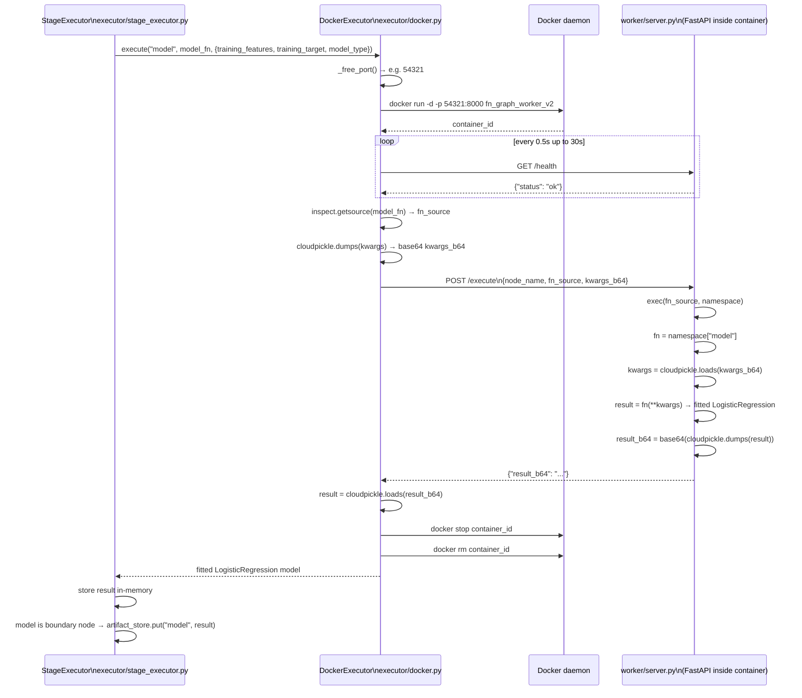

---

## Diagram 9 — Class Hierarchy & Interfaces

All abstract contracts and concrete implementations including StageExecutor.

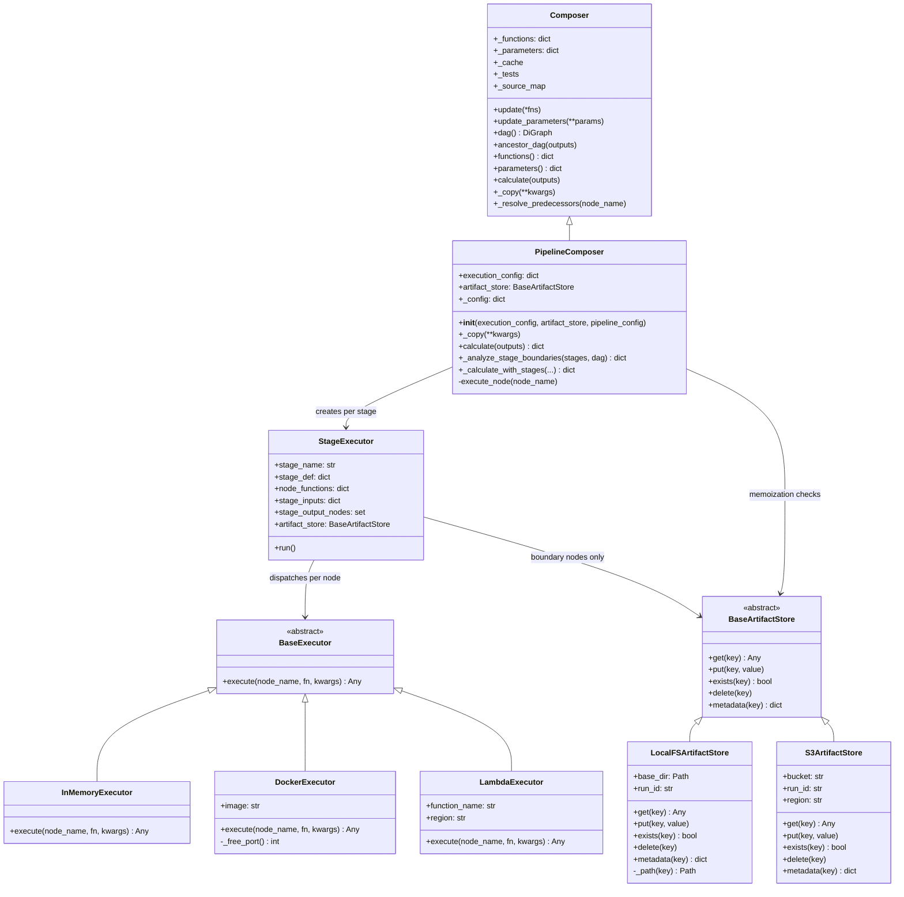

---

## Diagram 10 — Config-Driven Routing: Stages vs Node-Level

How the YAML config drives both execution paths.

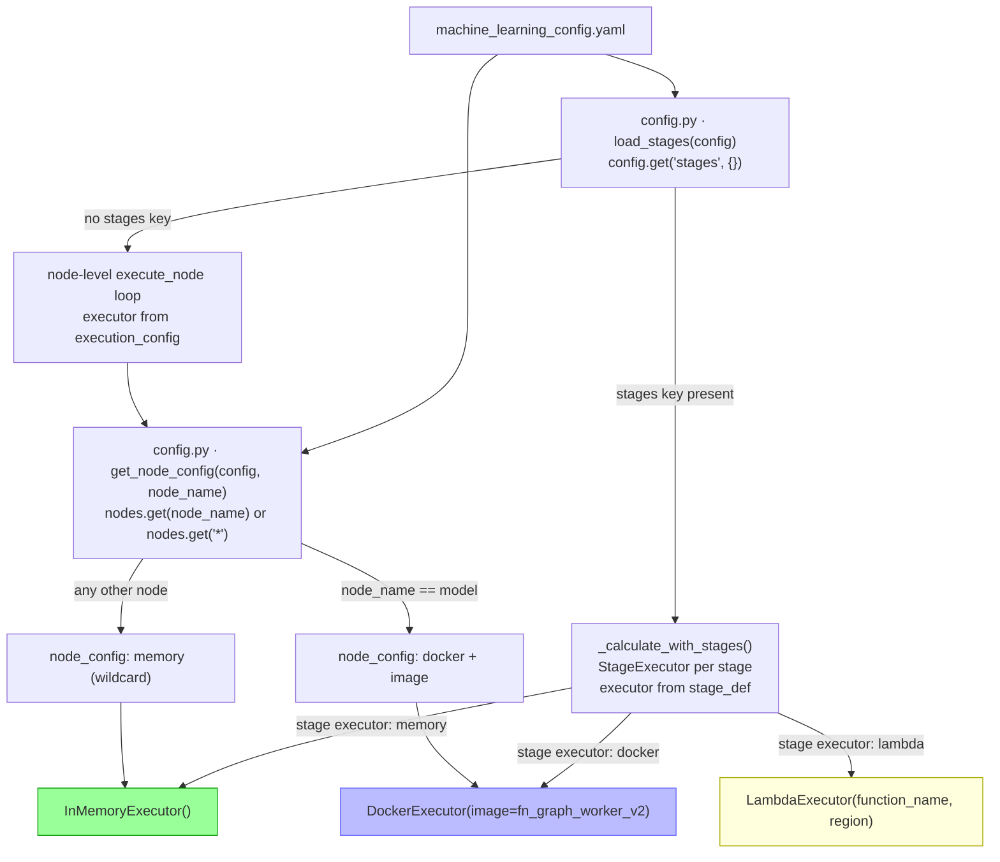

---

## Diagram 11 — Stage Boundary Analysis

Which nodes are boundary outputs (written to disk), boundary inputs (read from disk), and internal (memory only) for the ML pipeline.

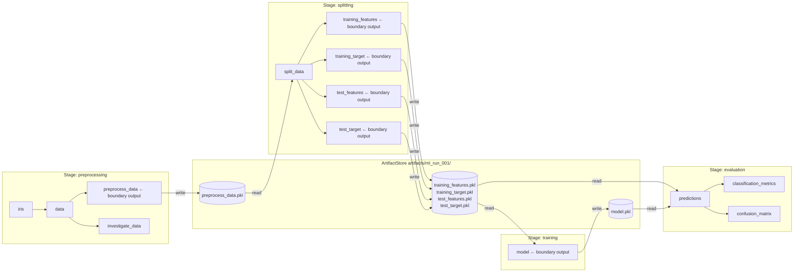

> Everything inside a stage box flows in Python memory. Disk is only touched at the arrows crossing stage lines.  
> 3 store writes per node-run vs 13 in the old node-level approach (iris, data, preprocess_data, investigate_data, split_data, training_features, training_target, test_features, test_target, model, predictions, classification_metrics, confusion_matrix).

---

## Diagram 12 — Parallel Stage Dispatch Loop

The exact algorithm inside `_calculate_with_stages()`.

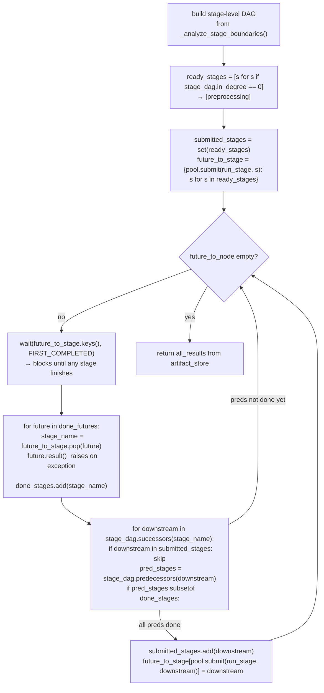

---

## Quick Reference — File-to-Responsibility Map

| File | Class / Key Methods | Responsibility |
|---|---|---|
| `run_pipeline.py` | `main()`, `_setup_log()`, `_Tee` | CLI entry, logging, PipelineComposer construction with `pipeline_config` |
| `composer.py` | `PipelineComposer.__init__`, `_copy`, `calculate`, `_analyze_stage_boundaries`, `_calculate_with_stages` | DAG walk, stage boundary analysis, parallel stage dispatch, node-level fallback |
| `config.py` | `load_config`, `get_executor`, `get_artifact_store`, `get_node_config`, `load_stages` | YAML → object factory, wildcard resolution, stage definition loading |
| `machine_learning.py` | `f = Composer().update_parameters().update(...)` | Pure pipeline definition — no infra knowledge |
| `executor/base.py` | `BaseExecutor.execute` | Abstract contract for all executors |
| `executor/memory.py` | `InMemoryExecutor.execute` | `fn(**kwargs)` directly in process |
| `executor/docker.py` | `DockerExecutor.execute`, `_free_port` | Spin container → health poll → HTTP POST → stop |
| `executor/lambda_executor.py` | `LambdaExecutor.execute` | boto3 invoke → deserialize |
| `executor/stage_executor.py` | `StageExecutor.run` | Run all stage nodes in topo order in-memory, write only boundary nodes to store |
| `artifact_store/base.py` | `BaseArtifactStore` | Abstract contract: get/put/exists/delete/metadata |
| `artifact_store/fs.py` | `LocalFSArtifactStore`, `_path`, `put` (atomic) | `artifacts/{run_id}/{node}.pkl` via cloudpickle |
| `artifact_store/s3.py` | `S3ArtifactStore` | Same interface, S3 backend |
| `worker/server.py` | `GET /health`, `POST /execute` | FastAPI inside Docker: exec fn_source in fresh namespace, return result |
| `machine_learning_config.yaml` | `stages`, `artifact_store`, `nodes` | Runtime wiring — defines stages, executors, and store without touching Python |
