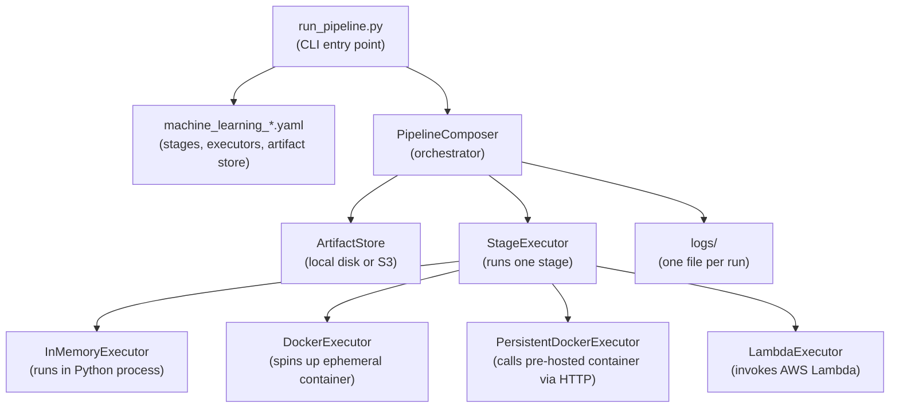
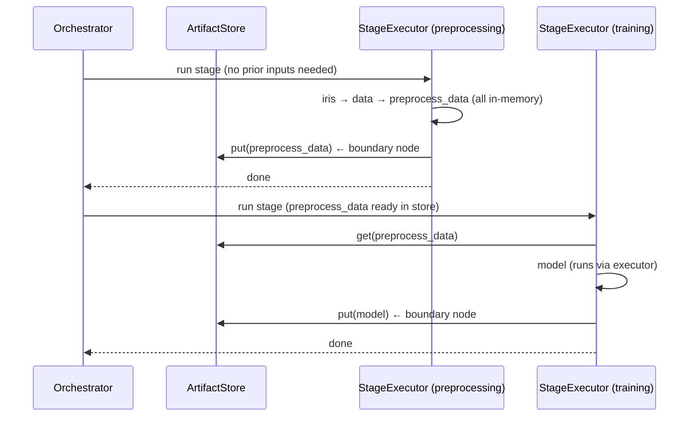
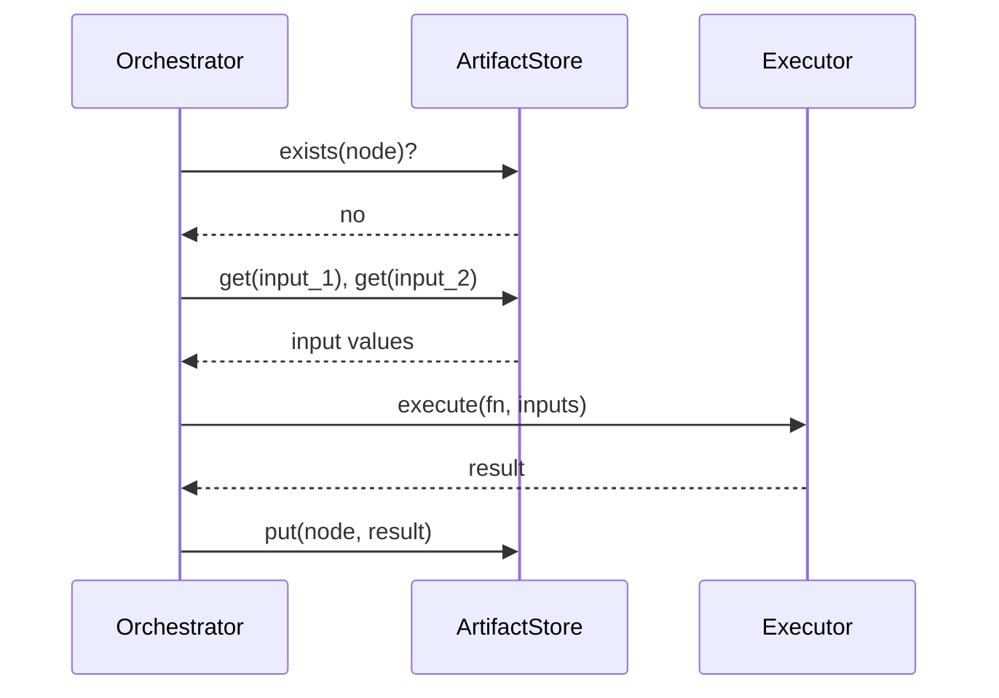

# fn_graph Pipeline Orchestration

A pluggable execution layer on top of [fn_graph](https://github.com/BusinessOptics/fn_graph) that lets you run any pipeline node locally, in Docker, or on AWS Lambda — just by changing a config file. Supports stage partitioning to reduce serialization overhead at stage boundaries.

---

## Architecture



---

## Data Flow — Stage-Based Execution



On the **second run**, each stage checks whether all its boundary output nodes already exist in the artifact store. If they do, the entire stage is skipped without executing any node.

---

## Data Flow — Node-Level Execution (fallback)



---

## Folder Structure

```
solution/                             <- fn_graph orchestration layer
├── run_pipeline.py                   # CLI entry point
├── composer.py                       # orchestrator — walks DAG, dispatches stages/nodes
├── config.py                         # loads yaml, builds executors, artifact stores, stages
│
├── machine_learning_config.yaml      # ML pipeline: memory + docker, stage partitioning
├── machine_learning_local.yaml       # ML pipeline: all in-memory, no Docker
├── machine_learning_multi_persistent.yaml  # ML pipeline: one persistent container per stage
│
├── executor/
│   ├── base.py                       # BaseExecutor (abstract)
│   ├── memory.py                     # runs fn directly in Python process
│   ├── docker.py                     # spins up ephemeral container, HTTP call, tears down
│   ├── persistent_docker.py          # calls pre-hosted container via HTTP, no exec()
│   ├── lambda_executor.py            # boto3 invoke, returns result
│   └── stage_executor.py             # runs all nodes in one stage, persists boundaries
│
├── artifact_store/
│   ├── base.py                       # BaseArtifactStore (abstract)
│   ├── fs.py                         # local disk — artifacts/{run_id}/{node}.pkl
│   └── s3.py                         # S3 — s3://bucket/{run_id}/{node}.pkl
│
└── logs/
    └── {pipeline}/{run_id}/{timestamp}.log

deploy/                               <- infrastructure (separate from orchestration)
├── worker/
│   ├── server.py                     # FastAPI worker — imports fn by module name, no exec()
│   ├── Dockerfile                    # fn_graph_worker_v2 image (fn_graph pre-installed)
│   ├── Dockerfile.lambda             # image for LambdaExecutor (pushed to ECR)
│   ├── lambda_handler.py             # Lambda handler
│   ├── requirements.txt
│   └── requirements.lambda.txt
├── docker-compose.yml                # single shared worker on port 8001
├── docker-compose-multi.yml          # one worker per stage, ports 8001-8004
└── lambda.py                         # one-shot Lambda deploy script
```

---

## How to Run

### Prerequisites

Set `PYTHONPATH` so the `fn_graph` package is importable:

**Windows (cmd):**
```cmd
set PYTHONPATH=C:\Users\GuptaGanesh\Desktop\New folder\fn_graph
```

**Windows (PowerShell):**
```powershell
$env:PYTHONPATH="C:\Users\GuptaGanesh\Desktop\New folder\fn_graph"
```

**Linux/macOS:**
```bash
export PYTHONPATH=/path/to/fn_graph
```

### Run locally (no Docker)

```cmd
cd fn_graph\examples\solution
python run_pipeline.py --pipeline fn_graph.examples.machine_learning --config machine_learning_local.yaml
```

Run it a second time to verify memoization — all stages are skipped and the run completes in under a second.

### Run with persistent Docker containers (one per stage)

**Step 1 — start the containers (one-time):**
```cmd
cd fn_graph\examples\deploy
docker compose -f docker-compose-multi.yml build
docker compose -f docker-compose-multi.yml up -d
```

**Step 2 — run the pipeline:**
```cmd
cd fn_graph\examples\solution
set PYTHONPATH=C:\Users\GuptaGanesh\Desktop\New folder\fn_graph && python run_pipeline.py --pipeline fn_graph.examples.machine_learning --config machine_learning_multi_persistent.yaml
```

**Tear down when done:**
```cmd
cd fn_graph\examples\deploy
docker compose -f docker-compose-multi.yml down
```

### Run with debug logging

```cmd
set PYTHONPATH=C:\Users\GuptaGanesh\Desktop\New folder\fn_graph && python run_pipeline.py --pipeline fn_graph.examples.machine_learning --config machine_learning_multi_persistent.yaml --debug
```

### Inspect all intermediate results (`--debug-artifacts`)

By default, only boundary output nodes and leaf output nodes are written to the artifact store. Pass `--debug-artifacts` to persist every node, including intra-stage intermediates — useful for debugging without changing the pipeline or config:

```cmd
set PYTHONPATH=C:\Users\GuptaGanesh\Desktop\New folder\fn_graph && python run_pipeline.py --pipeline fn_graph.examples.machine_learning --config machine_learning_local.yaml --debug-artifacts
```

After the run, every node's output will have a corresponding `.pkl` file under `artifacts/{run_id}/`.

---

## Executor Types

| Executor | When to use | Container lifecycle |
|---|---|---|
| `memory` | Local dev, fast nodes, unit tests | None — runs in-process |
| `docker` | Isolated execution, one-off heavy nodes | Spin up per node, tear down after |
| `persistent_docker` | Warm containers, repeated calls, pre-loaded models | Started externally via compose, stays running |
| `lambda` | Serverless, pay-per-call, burst workloads | Managed by AWS |

### How PersistentDockerExecutor works

The pipeline module is pre-installed inside the Docker image. When a node is dispatched, the executor sends only `{node_name, module, kwargs_b64}` — no source code over HTTP. The worker resolves the function via `importlib.import_module(module)` + `getattr(mod, node_name)`.

```
GET  /health               → { status: "ok" }
POST /execute              → { result_b64 }
     body: { node_name, module, kwargs_b64 }
```

---

## Stage Partitioning

### What it does

Stage partitioning groups pipeline nodes into named stages. Within a stage, all node results pass directly in memory — no serialization to disk between steps. Exactly two categories of nodes are persisted to the artifact store:

1. **Boundary output nodes** — consumed by a downstream stage (cross-stage handoff)
2. **Leaf output nodes** — the pipeline's final requested outputs (nodes with out-degree 0)

Everything else stays in memory and is never serialized to disk. This reduces unnecessary I/O: in a 10-node pipeline where 8 nodes pass results internally and only 2 cross stage lines, you write 2 artifacts instead of 10.

### Why it matters

- Large intermediate objects (DataFrames, NumPy arrays, trained models) can be expensive to serialize.
- Keeping intra-stage results in memory is faster and simpler.
- Stage boundaries are natural checkpoints — exactly where you want durability.
- Memoization granularity is at the stage level: a whole stage is skipped if all its boundary outputs already exist in the store.

### How boundary nodes work

When `_analyze_stage_boundaries` runs:
- It builds a map of every node to its stage.
- For each stage, it scans each node's predecessors and successors in the ancestor DAG.
- A node is a **boundary output** if any of its successors belong to a different stage.
- A node is a **boundary input** (for the consuming stage) if any of its predecessors belong to a different stage.
- Everything else is **internal** — stays in memory, never hits the artifact store.

The stage-level DAG (which stages depend on which others) is derived from these boundary relationships and used to dispatch stages in parallel.

### How to define stages in YAML

```yaml
stages:
  preprocessing:
    executor: memory
    nodes: [iris, data, preprocess_data, investigate_data]

  splitting:
    executor: memory
    nodes: [split_data, training_features, training_target, test_features, test_target]

  training:
    executor: persistent_docker
    url: http://localhost:8003
    nodes: [model]

  evaluation:
    executor: memory
    nodes: [predictions, classification_metrics, confusion_matrix]
```

- Every node must appear in exactly one stage.
- The `executor` key applies to all nodes in the stage.
- For `persistent_docker`, also specify `url`.
- Node order within `nodes:` does not matter — topological order is derived from the DAG.

### Parallel stage dispatch

Stages with no un-met dependencies are dispatched simultaneously using `ThreadPoolExecutor`. The orchestrator waits for completed stages with `FIRST_COMPLETED`, then checks which downstream stages just became unblocked, and dispatches them immediately.

---

## Config Reference

```yaml
pipeline:
  run_id: ml_run_001          # unique ID — artifacts saved under artifacts/{run_id}/
  on_failure: finish_running  # keep going if a node fails

artifact_store:
  type: fs                    # "fs" = local disk, "s3" = AWS S3
  base_dir: ./artifacts       # root folder for all artifacts (fs only)
  # For S3:
  # bucket: my-fn-graph-bucket
  # region: us-east-1

stages:                       # optional — enables stage-based execution
  stage_name:
    executor: memory          # memory | docker | persistent_docker | lambda
    url: http://localhost:8001  # required for persistent_docker
    nodes: [node1, node2]

nodes:                        # fallback node-level config (used when no stages: defined)
  model:
    executor: docker
    image: fn_graph_worker_v2
  "*":
    executor: memory          # default for any node not listed above
```

---

## Environment Variables

| Variable | Purpose | Default |
|---|---|---|
| `PYTHONPATH` | Makes `fn_graph` importable | Must be set manually |
| `AWS_REGION` | Region for Lambda executor | From boto3 config |
| `AWS_ACCESS_KEY_ID` | AWS credentials for S3/Lambda | From AWS config |
| `AWS_SECRET_ACCESS_KEY` | AWS credentials for S3/Lambda | From AWS config |

A `.env` file in the solution directory is loaded automatically if `python-dotenv` is installed.

---

## Logs

Every run writes a timestamped log file so you can compare runs side by side.

```
logs/
├── machine_learning/
│   └── ml_run_001/
│       ├── 2026-04-09_10-00-00.log   ← first run
│       └── 2026-04-09_10-05-00.log   ← second run (all memoized)
└── finance/
    └── finance_run_001/
        └── 2026-04-09_10-10-00.log
```

Log path pattern: `logs/{pipeline_name}/{run_id}/{timestamp}.log`

### What the logs show

**First run — stage boundary analysis:**
```
[PipelineComposer] === Stage Boundary Analysis ===
[PipelineComposer] stage 'preprocessing':
  inputs   (load from store): []
  outputs  (save to store):   ['preprocess_data']
  internal (memory only):     ['data', 'investigate_data', 'iris']
```

**First run — persistent docker dispatch:**
```
[PersistentDockerExecutor] dispatching 'model' -> http://localhost:8003
[PersistentDockerExecutor] 'model' complete, output type: LogisticRegression
```

**Second run — entire stage skipped:**
```
[PipelineComposer] stage 'preprocessing' fully memoized — skipping
[PipelineComposer] stage 'training' fully memoized — skipping
```

### Forcing a fresh run

Change `run_id` in the yaml — a new ID means a new artifact folder, so everything re-executes:

```yaml
pipeline:
  run_id: ml_run_002    # was ml_run_001
```

Or delete specific artifacts:

```cmd
del artifacts\ml_run_001\model.pkl
```

On the next run, the `training` stage re-executes (and `evaluation` downstream of it), while `preprocessing` and `splitting` remain cached.
