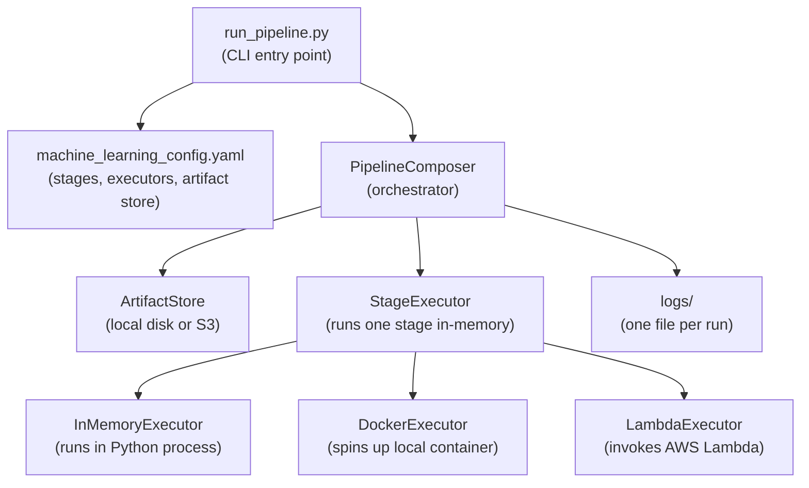
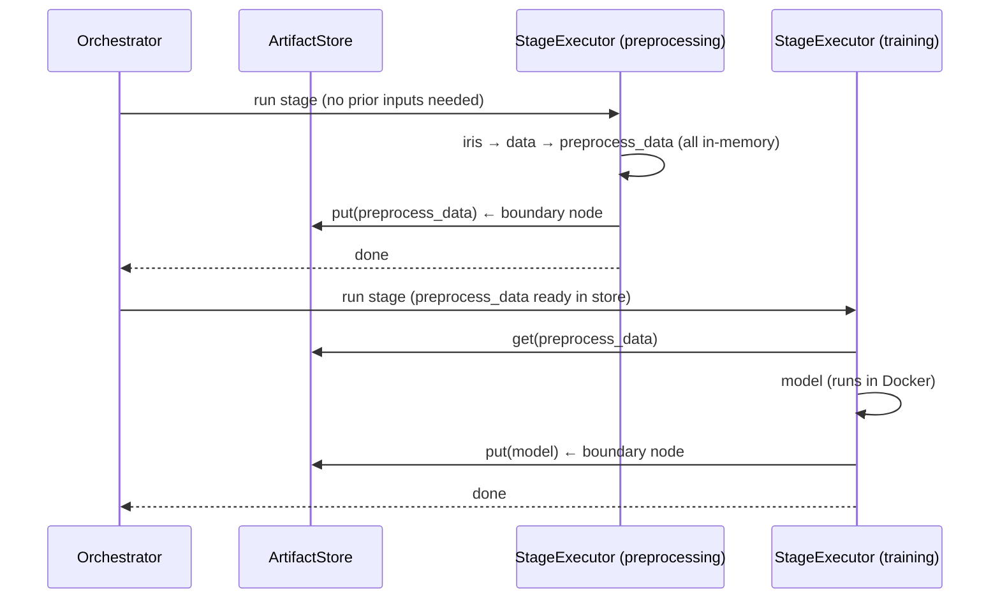
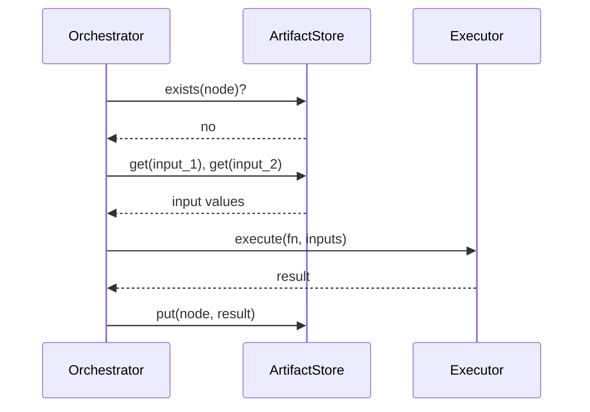

# fn_graph Pipeline Orchestration

A pluggable execution layer on top of [fn_graph](https://github.com/BusinessOptics/fn_graph) that lets you run any pipeline node locally, in Docker, or on AWS Lambda — just by changing a config file. Supports stage partitioning to reduce serialization overhead at stage boundaries.

---

## Architecture



---

## Data Flow — Stage-Based Execution



On the **second run**, each stage checks whether all its boundary output nodes already exist in the artifact store. If they do, the entire stage is skipped without executing any node.

---

## Data Flow — Node-Level Execution (fallback)



---

## Folder Structure

```
solution/
├── run_pipeline.py           # CLI entry point
├── composer.py               # orchestrator — walks DAG, calls executors or StageExecutor
├── config.py                 # loads yaml, builds executors, artifact stores, and stages
├── deploy_lambda.py          # one-shot Lambda deploy script
│
├── machine_learning_config.yaml  # ML pipeline: memory + docker, with stage partitioning
├── machine_learning_local.yaml   # ML pipeline: all memory, no Docker
│
├── executor/
│   ├── base.py               # BaseExecutor (abstract)
│   ├── memory.py             # runs fn directly in process
│   ├── docker.py             # spins up container, HTTP call, tears down
│   ├── lambda_executor.py    # boto3 invoke, returns result
│   └── stage_executor.py     # runs all nodes in one stage in-memory, persists boundaries
│
├── artifact_store/
│   ├── base.py               # BaseArtifactStore (abstract)
│   ├── fs.py                 # local disk — artifacts/{run_id}/{node}.pkl
│   └── s3.py                 # S3 — s3://bucket/{run_id}/{node}.pkl
│
├── worker/
│   ├── server.py             # FastAPI app inside Docker container
│   ├── lambda_handler.py     # handler inside Lambda
│   ├── Dockerfile            # image for DockerExecutor
│   └── Dockerfile.lambda     # image for LambdaExecutor (pushed to ECR)
│
└── logs/
    └── {pipeline}/{run_id}/{timestamp}.log
```

---

## How to Run

### Prerequisites

Set `PYTHONPATH` so the `fn_graph` package is importable:

```cmd
set PYTHONPATH=C:\Users\GuptaGanesh\Desktop\new\fn_graph
```

Or on Linux/macOS:
```bash
export PYTHONPATH=/path/to/fn_graph
```

### Run the ML pipeline

```cmd
cd fn_graph\examples\solution
python run_pipeline.py --pipeline fn_graph.examples.machine_learning --config machine_learning_config.yaml
```

Run it a second time to verify memoization — all nodes should be skipped and the run completes in under a second.

### Run with a different config (no Docker)

```cmd
python run_pipeline.py --pipeline fn_graph.examples.machine_learning --config machine_learning_local.yaml
```

### Run the finance pipeline

```cmd
python run_pipeline.py --pipeline fn_graph.examples.finance --config finance_config.yaml
```

---

## Docker Build

The Docker worker image must be built before running any node with `executor: docker`:

```cmd
cd fn_graph\examples\solution
docker build -t fn_graph_worker_v2 ./worker/
```

This builds the FastAPI worker server that receives function source + pickled inputs over HTTP, executes the node, and returns the pickled result.

---

## Stage Partitioning

### What it does

Stage partitioning groups pipeline nodes into named stages. Within a stage, all node results pass directly in memory — no serialization to disk between steps. Only nodes at stage *boundaries* (where one stage hands off to another) are persisted to the artifact store.

This reduces unnecessary I/O: in a 10-node pipeline where 8 nodes pass results internally and only 2 cross stage lines, you write 2 artifacts instead of 10.

### Why it matters

- Large intermediate objects (DataFrames, NumPy arrays, trained models) can be expensive to serialize.
- Keeping intra-stage results in memory is faster and simpler.
- Stage boundaries are natural checkpoints — exactly where you want durability.
- Memoization granularity is at the stage level: a whole stage is skipped if all its boundary outputs already exist in the store.

### How boundary nodes work

When `_analyze_stage_boundaries` runs:
- It builds a map of every node to its stage.
- For each stage, it scans each node's predecessors and successors in the ancestor DAG.
- A node is a **boundary output** if any of its successors belong to a different stage.
- A node is a **boundary input** (for the consuming stage) if any of its predecessors belong to a different stage.
- Everything else is **internal** — stays in memory, never hits the artifact store.

The stage-level DAG (which stages depend on which others) is derived from these boundary relationships and used to dispatch stages in parallel.

### How to define stages in YAML

```yaml
stages:
  preprocessing:
    executor: memory
    nodes: [iris, data, preprocess_data, investigate_data]

  splitting:
    executor: memory
    nodes: [split_data, training_features, training_target, test_features, test_target]

  training:
    executor: docker
    image: fn_graph_worker_v2
    nodes: [model]

  evaluation:
    executor: memory
    nodes: [predictions, classification_metrics, confusion_matrix]
```

- Every node must appear in exactly one stage.
- The `executor` key applies to all nodes in the stage. For `docker`, also specify `image`.
- Node order within `nodes:` does not matter — topological order is derived from the DAG.

### Parallel stage dispatch

Stages with no un-met dependencies are dispatched simultaneously using `ThreadPoolExecutor`. The orchestrator waits for completed stages with `FIRST_COMPLETED`, then checks which downstream stages just became unblocked, and dispatches them immediately.

In the ML pipeline, `preprocessing` and (conceptually) any unrelated stage run first. Once `preprocessing` completes, `splitting` is dispatched. Once `splitting` completes, `training` is dispatched. Once `training` completes, `evaluation` is dispatched. (Linear DAG here — no parallelism between these specific stages, but the infrastructure supports parallel branches.)

### How to add a new stage

1. Identify which nodes belong to the new stage.
2. Remove those nodes from their current stage's `nodes:` list.
3. Add a new stage entry:

```yaml
stages:
  my_new_stage:
    executor: memory   # or docker / lambda
    nodes: [node_a, node_b]
```

4. The orchestrator automatically detects new boundary nodes and adjusts the stage DAG.

---

## Config Reference

```yaml
pipeline:
  run_id: ml_run_001        # unique ID — artifacts saved under artifacts/{run_id}/
  on_failure: finish_running  # keep going if a node fails (currently informational)

artifact_store:
  type: fs                  # "fs" = local disk, "s3" = AWS S3
  base_dir: ./artifacts     # root folder for all artifacts (fs only)
  # For S3:
  # bucket: my-fn-graph-bucket
  # region: us-east-1

stages:                     # optional — enables stage-based execution
  stage_name:
    executor: memory        # executor for all nodes in this stage
    nodes: [node1, node2]

nodes:                      # fallback node-level config (used when no stages: defined)
  model:
    executor: docker
    image: fn_graph_worker_v2
  "*":
    executor: memory        # default for any node not listed above
```

---

## Environment Variables

| Variable | Purpose | Default |
|---|---|---|
| `PYTHONPATH` | Makes `fn_graph` importable | Must be set manually |
| `AWS_REGION` | Region for Lambda executor | From boto3 config |
| `AWS_ACCESS_KEY_ID` | AWS credentials for S3/Lambda | From AWS config |
| `AWS_SECRET_ACCESS_KEY` | AWS credentials for S3/Lambda | From AWS config |

A `.env` file in the solution directory is loaded automatically if `python-dotenv` is installed.

---

## Logs

Every run writes a timestamped log file so you can compare runs side by side.

```
logs/
├── machine_learning/
│   └── ml_run_001/
│       ├── 2026-04-09_10-00-00.log   ← first run
│       └── 2026-04-09_10-05-00.log   ← second run (all memoized)
└── finance/
    └── finance_run_001/
        └── 2026-04-09_10-10-00.log
```

Log path pattern: `logs/{pipeline_name}/{run_id}/{timestamp}.log`

### What the logs show

**First run — stage boundary analysis:**
```
[PipelineComposer] === Stage Boundary Analysis ===
[PipelineComposer] stage 'preprocessing':
  inputs   (load from store): []
  outputs  (save to store):   ['preprocess_data']
  internal (memory only):     ['data', 'investigate_data', 'iris']
```

**First run — parallel stage dispatch:**
```
[PipelineComposer] dispatching 1 stage(s) in parallel: ['preprocessing']
[PipelineComposer] stage 'preprocessing' finished, checking downstream stages
[PipelineComposer] stage 'splitting' unblocked — dispatching
```

**First run — Docker container lifecycle:**
```
[DockerExecutor] starting container for node: model
[DockerExecutor] container healthy, sending work
[DockerExecutor] node model complete, output type: LinearRegression
[DockerExecutor] container stopped and removed
```

**Second run — entire stage skipped:**
```
[PipelineComposer] stage 'preprocessing' fully memoized — skipping
[PipelineComposer] stage 'training' fully memoized — skipping
```

### Forcing a fresh run

Change `run_id` in the yaml — a new ID means a new artifact folder, so everything re-executes:

```yaml
pipeline:
  run_id: ml_run_002    # was ml_run_001
```

Or delete specific artifacts:

```cmd
del artifacts\ml_run_001\model.pkl
```

On the next run, the `training` stage re-executes (and `evaluation` downstream of it), while `preprocessing` and `splitting` remain cached.
