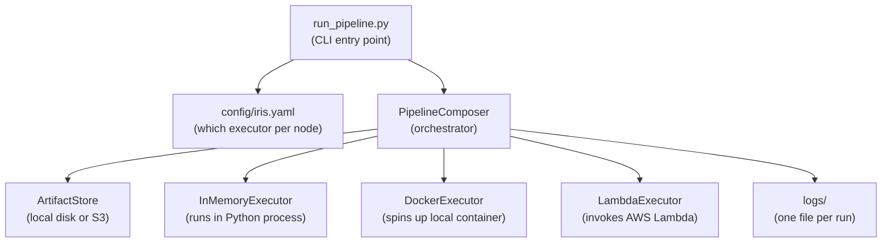
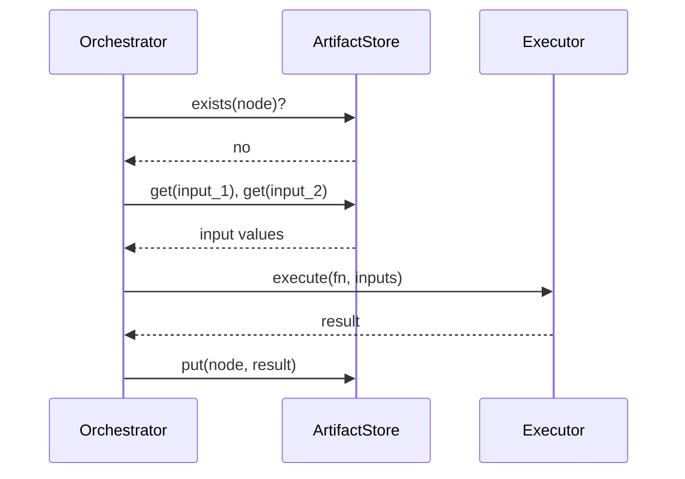

# fn_graph Pipeline Orchestration

A pluggable execution layer on top of [fn_graph](https://github.com/BusinessOptics/fn_graph) that lets you run any pipeline node locally, in Docker, or on AWS Lambda — just by changing a config file.

---

## Architecture



---

## Data Flow (one node)



On the **second run**, the orchestrator asks `exists(node)?`, gets `yes`, and skips — nothing is re-executed.

---

## Folder Structure

```
solution/
├── run_pipeline.py        # CLI entry point
├── composer.py            # orchestrator — walks DAG, calls executors
├── config.py              # loads yaml, builds executors and artifact stores
├── deploy_lambda.py       # one-shot Lambda deploy script
│
├── config/
│   ├── iris.yaml          # iris pipeline: memory + docker + lambda
│   └── finance.yaml       # finance pipeline: all memory
│
├── executor/
│   ├── base.py            # BaseExecutor (abstract)
│   ├── memory.py          # runs fn directly in process
│   ├── docker.py          # spins up container, HTTP call, tears down
│   └── lambda_executor.py # boto3 invoke, returns result
│
├── artifact_store/
│   ├── base.py            # BaseArtifactStore (abstract)
│   ├── fs.py              # local disk — artifacts/{run_id}/{node}.pkl
│   └── s3.py              # S3 — s3://bucket/{run_id}/{node}.pkl
│
├── worker/
│   ├── server.py          # FastAPI app inside Docker container
│   ├── lambda_handler.py  # handler inside Lambda
│   ├── Dockerfile         # image for DockerExecutor
│   └── Dockerfile.lambda  # image for LambdaExecutor (pushed to ECR)
│
└── logs/
    └── {pipeline}/{run_id}/{timestamp}.log
```

---

## How It Works

### 1. Config drives everything
```yaml
nodes:
  model:
    executor: docker       # change this line to move a node
  split_data:
    executor: lambda
  iris:
    executor: memory
```
No pipeline code changes needed.

### 2. Orchestrator walks the DAG
`fn_graph` builds a dependency graph from function signatures. The orchestrator walks it in topological order, checks the artifact store for cached outputs, and dispatches each node to the right executor.

### 3. Executors are interchangeable
| Executor | Where it runs | How result comes back |
|---|---|---|
| `memory` | Local Python process | Direct return value |
| `docker` | Local container (per node) | HTTP response |
| `lambda` | AWS Lambda | boto3 response payload |

All three receive the same inputs and return the same result — the orchestrator doesn't care which one ran.

### 4. Artifact store is the glue
Every node output is serialized (cloudpickle) and saved after execution. The next node loads its inputs from the store — not from memory. This means:
- Nodes can run in completely different processes / machines
- Re-runs skip completed nodes automatically
- Switch from `fs` to `s3` in one line to share artifacts across machines

---

## Running a Pipeline

```cmd
set PYTHONPATH=C:\path\to\fn_graph

# iris (memory + docker + lambda)
py run_pipeline.py --pipeline fn_graph.examples.machine_learning --config config\iris.yaml

# finance (all memory)
py run_pipeline.py --pipeline fn_graph.examples.finance --config config\finance.yaml
```

Run the same command twice — the second run skips every cached node and completes instantly. Compare the two log files in `logs/` to see the difference.

---

## One Config Per Pipeline

Every fn_graph pipeline gets its own yaml file in `config/`. The config is completely independent of the pipeline code — the same pipeline can have multiple configs for different environments or experiments.

```
config/
├── iris.yaml          # iris: memory + docker + lambda (production-like)
├── finance.yaml       # finance: all memory (fast local run)
├── iris_local.yaml    # iris: all memory (no cloud needed)
└── iris_s3.yaml       # iris: artifacts in S3 instead of local disk
```

### What each config controls

```yaml
pipeline:
  run_id: iris_run_001        # unique ID for this run — artifacts saved here
  on_failure: finish_running  # keep going if a node fails

artifact_store:
  type: fs                    # "fs" = local disk, "s3" = AWS S3
  base_dir: ./artifacts       # root folder for all artifacts

nodes:
  iris:
    executor: memory          # this node runs locally
  model:
    executor: docker          # this node runs in a container
    image: fn_graph_worker_v2
  split_data:
    executor: lambda          # this node runs on AWS Lambda
    function_name: fn_graph_worker_lambda
    region: us-east-1
  "*":
    executor: memory          # default for any node not listed above
```

### Switching environments

To run the same iris pipeline entirely locally (no Docker, no Lambda):

```yaml
# config/iris_local.yaml
pipeline:
  run_id: iris_local_001
artifact_store:
  type: fs
  base_dir: ./artifacts
nodes:
  "*":
    executor: memory
```

```cmd
py run_pipeline.py --pipeline fn_graph.examples.machine_learning --config config\iris_local.yaml
```

To use S3 as the artifact store instead of local disk:

```yaml
artifact_store:
  type: s3
  bucket: fn-graph-pipeline-artifacts
```

No other changes. The orchestrator, executors, and pipeline code are untouched.

### Adding a brand new pipeline

1. Write (or point at) any Python module that ends with `f = Composer()...`
2. Create `config/{name}.yaml` with its node names and executors
3. Run:

```cmd
py run_pipeline.py --pipeline your.module.path --config config\name.yaml
```

That's it. The orchestration layer discovers nodes from the DAG automatically.

---

## Logs

Every run writes a timestamped log file so you can compare runs side by side.

```
logs/
├── machine_learning/
│   └── iris_run_001/
│       ├── 2026-04-01_10-00-00.log   ← first run
│       └── 2026-04-01_10-05-00.log   ← second run
└── finance/
    └── finance_run_001/
        └── 2026-04-01_10-10-00.log
```

Log path pattern: `logs/{pipeline_name}/{run_id}/{timestamp}.log`

### What the logs show

**First run** — every node executes:
```
[PipelineComposer] --- node: model (12/15) ---
[LocalFSArtifactStore] exists(model): False
[DockerExecutor] starting container for node: model
[DockerExecutor] container healthy, sending work
[DockerExecutor] node model complete, output type: LogisticRegression
[DockerExecutor] container stopped and removed
```

**Second run** — every cached node is skipped:
```
[PipelineComposer] --- node: model (12/15) ---
[LocalFSArtifactStore] exists(model): True
[PipelineComposer] output exists, skipping: model
```

### Forcing a fresh run

Change `run_id` in the yaml — a new ID means a new artifact folder, so everything re-executes:

```yaml
pipeline:
  run_id: iris_run_002    # was iris_run_001
```

Or delete just the nodes you want to re-run:

```cmd
del artifacts\iris_run_001\model.pkl
```

On the next run, only `model` and its downstream nodes will re-execute — everything upstream stays cached.
